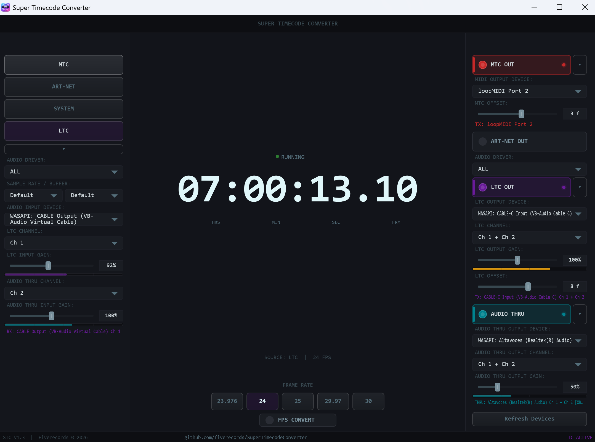

# Super Timecode Converter

A professional timecode routing and conversion tool built with C++ and [JUCE](https://juce.com/). Receives timecode from multiple sources and routes it to multiple outputs simultaneously — ideal for live events, broadcast, post-production, and AV installations.


---

## Features

### Inputs (select one)
- **MTC (MIDI Time Code)** — receive timecode from any MIDI device
- **Art-Net** — receive Art-Net timecode over the network (configurable interface/port)
- **LTC (Linear Time Code)** — decode LTC audio signal from any audio input device and channel
- **System Time** — use the system clock as a timecode source

### Outputs (enable any combination)
- **MTC Out** — transmit MIDI Time Code (Quarter Frame + Full Frame messages)
- **Art-Net Out** — broadcast ArtTimeCode packets on any network interface
- **LTC Out** — generate LTC audio signal on any audio output device and channel
- **Audio Thru** — passthrough audio from the LTC input device to a separate output device (independent routing)

### Audio Monitoring
- **VU Meters** — real-time level metering for all audio paths (LTC input, LTC output, Audio Thru input, Audio Thru output) with color-coded feedback (green → yellow → red)
- **Per-channel gain control** — independent input/output gain for LTC and Audio Thru paths

### Synchronization
- **Frame rate support:** 24, 25, 29.97 (drop-frame), 30 fps
- **Auto-detection:** frame rate is automatically detected from incoming MTC, Art-Net, or LTC signals
- **Output frame offsets** — independent offset per output (MTC, Art-Net, LTC) from -30 to +30 frames, to compensate for device latency or synchronization differences

### Additional Capabilities
- **Stereo or mono output:** configurable per output (LTC Out and Audio Thru)
- **Driver type filtering:** filter audio devices by driver type (WASAPI, ASIO, DirectSound on Windows; CoreAudio on macOS; ALSA on Linux)
- **Configurable sample rate and buffer size**
- **ASIO support** for low-latency professional audio interfaces (Windows)
- **Device conflict detection** to prevent multiple outputs from opening the same device
- **Collapsible UI panels** to reduce clutter and focus on active sections
- **Persistent settings** — all configuration is saved automatically and restored on launch
- **Dark theme UI** with a clean, professional look

---

## Screenshot



---

## Getting Started

### Prerequisites

- **JUCE Framework 7.x or 8.x** — download from [juce.com](https://juce.com/get-juce/) or clone from [GitHub](https://github.com/juce-framework/JUCE)

#### Windows
- Windows 10/11
- Visual Studio 2022 (Community, Professional, or Enterprise)
- ASIO SDK (optional, for ASIO device support) — download from [Steinberg](https://www.steinberg.net/developers/)

#### macOS
- macOS 12 Monterey or later
- Xcode 14+

#### Linux
- Ubuntu 22.04+ / Debian 12+ (or equivalent)
- GCC 11+ or Clang 14+
- Development packages: `libfreetype-dev libx11-dev libxrandr-dev libxinerama-dev libxcursor-dev libxcomposite-dev libfontconfig1-dev libasound2-dev`

### Build Instructions

#### Option A: CMake (all platforms)

1. **Clone the repository:**
   ```bash
   git clone https://github.com/fiverecords/SuperTimecodeConverter.git
   cd SuperTimecodeConverter
   ```

2. **Clone JUCE** (if you don't have it already):
   ```bash
   git clone --depth 1 --branch 8.0.6 https://github.com/juce-framework/JUCE.git ../JUCE
   ```

3. **Create a `CMakeLists.txt`** in the project root:
   ```cmake
   cmake_minimum_required(VERSION 3.22)
   project(SuperTimecodeConverter VERSION 1.2)

   set(CMAKE_CXX_STANDARD 17)
   set(CMAKE_CXX_STANDARD_REQUIRED ON)

   # Adjust this path to where your JUCE installation is located
   add_subdirectory(${CMAKE_CURRENT_SOURCE_DIR}/../JUCE ${CMAKE_BINARY_DIR}/JUCE)

   juce_add_gui_app(SuperTimecodeConverter
       PRODUCT_NAME "Super Timecode Converter"
       COMPANY_NAME "Fiverecords"
       VERSION "1.2"
   )

   juce_generate_juce_header(SuperTimecodeConverter)

   target_sources(SuperTimecodeConverter PRIVATE
       Main.cpp
       MainComponent.cpp
   )

   target_compile_definitions(SuperTimecodeConverter PRIVATE
       JUCE_WEB_BROWSER=0
       JUCE_USE_CURL=0
       JUCE_APPLICATION_NAME_STRING="$<TARGET_PROPERTY:SuperTimecodeConverter,JUCE_PRODUCT_NAME>"
       JUCE_APPLICATION_VERSION_STRING="$<TARGET_PROPERTY:SuperTimecodeConverter,JUCE_VERSION>"
   )

   target_link_libraries(SuperTimecodeConverter PRIVATE
       juce::juce_audio_basics
       juce::juce_audio_devices
       juce::juce_audio_formats
       juce::juce_audio_utils
       juce::juce_core
       juce::juce_events
       juce::juce_graphics
       juce::juce_gui_basics
       juce::juce_gui_extra
       juce::juce_recommended_config_flags
   )
   ```

4. **Build:**
   ```bash
   cmake -B build -DCMAKE_BUILD_TYPE=Release
   cmake --build build -j$(nproc)
   ```

5. **Run:**
   - The binary will be in `build/SuperTimecodeConverter_artefacts/Release/`

#### Option B: Projucer (Windows / macOS)

1. **Clone the repository:**
   ```bash
   git clone https://github.com/fiverecords/SuperTimecodeConverter.git
   ```

2. **Open Projucer** (included with JUCE) and create a new GUI Application project pointing to the source files in this repository.

3. **Configure modules:** Set the JUCE modules path to your local JUCE installation. If using ASIO on Windows, set the ASIO SDK path in the exporter settings.

4. **Export and build:**
   - Click "Save and Open in IDE" in Projucer
   - **Windows:** Build the solution in Visual Studio (Release or Debug)
   - **macOS:** Build the project in Xcode (Release or Debug)

### ASIO Setup (Windows, Optional)

To enable ASIO support:
1. Download the ASIO SDK from Steinberg
2. Extract it to a known path (e.g., `C:\SDKs\asiosdk_2.3.3_2019-06-14`)
3. Add the ASIO SDK path to your project's header search paths
4. Enable `JUCE_ASIO=1` in the project preprocessor definitions

---

## Usage

### Basic Workflow

1. **Select an input source** from the left panel (MTC, Art-Net, System, or LTC)
2. **Enable one or more outputs** from the right panel
3. **Select the frame rate** or let it auto-detect from the input signal
4. The timecode display in the center shows the current time in real-time

### Output Frame Offsets

Each timecode output (MTC, Art-Net, LTC) has an independent frame offset control (-30 to +30 frames). Use this to compensate for device latency or to intentionally advance/delay timecode to specific destinations. Double-click the offset slider to reset to zero.

### Audio Thru

The Audio Thru feature lets you route audio (e.g., music or program audio) from a channel on the LTC input device to a separate output device. This is useful when your LTC signal arrives on one channel while program audio arrives on another — you can decode LTC and pass through the audio independently.

### Settings

All settings are automatically saved to:
- **Windows:** `%APPDATA%/SuperTimecodeConverter/settings.json`
- **macOS:** `~/Library/Application Support/SuperTimecodeConverter/settings.json`
- **Linux:** `~/.config/SuperTimecodeConverter/settings.json`

---

## Architecture

The application is built around a modular architecture:

| Component | Description |
|---|---|
| `TimecodeCore.h` | Core timecode types, frame rate utilities, SMPTE drop-frame logic, atomic pack/unpack helpers |
| `TimecodeDisplay.h` | Real-time timecode display widget |
| `LevelMeter.h` | Real-time VU meter component with clipping indicator |
| `NetworkUtils.h` | Cross-platform network interface enumeration (Windows/macOS/Linux) |
| `MtcInput.h` | MIDI Time Code receiver (Quarter Frame + Full Frame) with interpolation |
| `MtcOutput.h` | MIDI Time Code transmitter (high-resolution timer with fractional accumulator) |
| `ArtnetInput.h` | Art-Net timecode receiver (UDP) with bind fallback |
| `ArtnetOutput.h` | Art-Net timecode broadcaster (UDP) with drift-free timing |
| `LtcInput.h` | LTC audio decoder with passthrough ring buffer (SPSC) |
| `LtcOutput.h` | LTC audio encoder with auto-increment and biphase parity |
| `AudioThru.h` | Audio passthrough with independent device routing |
| `CustomLookAndFeel.h` | Dark theme UI styling and cross-platform font selection |
| `AppSettings.h` | JSON-based persistent settings with backward-compatible loading |
| `MainComponent.*` | Main UI, routing logic, and device management |

### Key Design Decisions

- **Lock-free audio:** LTC decode and audio passthrough use lock-free ring buffers (SPSC) for real-time safety
- **Independent audio devices:** LTC Input, LTC Output, and Audio Thru each manage their own `AudioDeviceManager`, allowing independent device selection
- **Fractional accumulators:** MTC and Art-Net outputs use fractional timing accumulators to eliminate drift from integer-ms timer resolution
- **Background device scanning:** audio devices are scanned on a background thread to avoid blocking the UI on startup
- **Two-phase initialization:** settings are loaded in two phases — non-audio settings are applied immediately, while audio device settings are applied after the background scan completes
- **Cross-platform:** built with JUCE for native performance on Windows, macOS, and Linux

---

## Contributing

Contributions are welcome! Please see [CONTRIBUTING.md](CONTRIBUTING.md) for guidelines.

---

## License

This project is licensed under the MIT License — see the [LICENSE](LICENSE) file for details.

---

## Credits

Developed by **Joaquin Villodre** — [github.com/fiverecords](https://github.com/fiverecords)

Built with [JUCE](https://juce.com/) — the cross-platform C++ framework for audio applications.

---

## Links

- [GitHub Repository](https://github.com/fiverecords/SuperTimecodeConverter)
- [JUCE Framework](https://juce.com/)
- [Art-Net Protocol](https://art-net.org.uk/)
- [MIDI Time Code Specification](https://en.wikipedia.org/wiki/MIDI_timecode)
