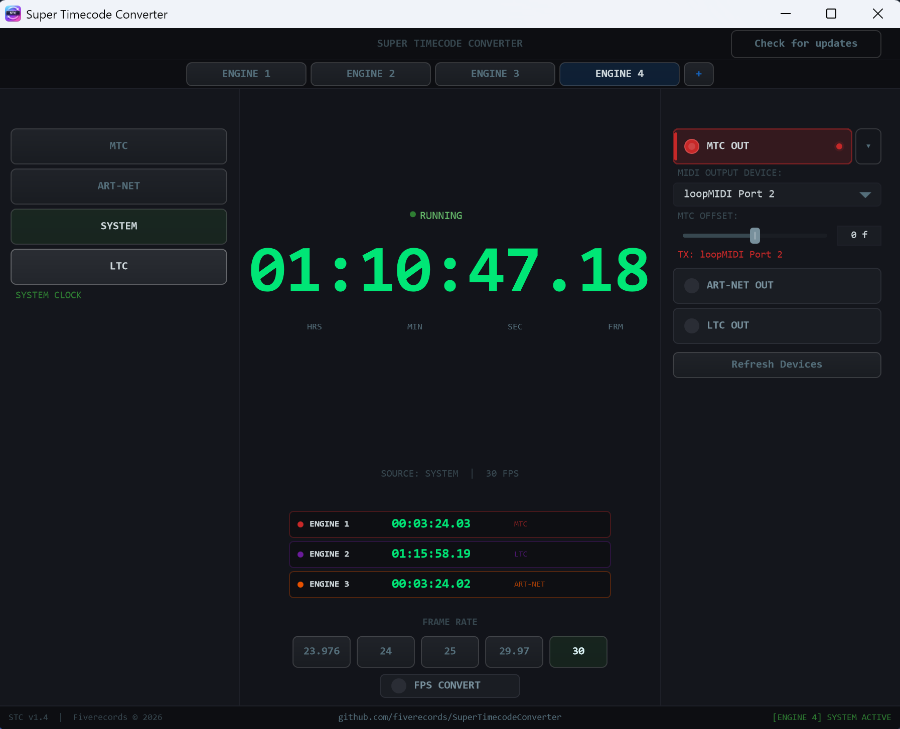

# Super Timecode Converter

A professional timecode routing and conversion tool built with C++ and [JUCE](https://juce.com/). Run up to **8 independent timecode engines** simultaneously — each with its own input source, output destinations, frame rate, and offset. Ideal for live events, broadcast, post-production, and AV installations.

[](https://img.shields.io/badge/platform-Windows-blue)
[](https://img.shields.io/badge/platform-macOS-lightgrey)
[](https://img.shields.io/badge/platform-Linux-yellow)
[](https://img.shields.io/badge/language-C%2B%2B17-orange)
[](https://img.shields.io/badge/framework-JUCE%208-green)
[](https://img.shields.io/badge/license-MIT-brightgreen)

---

## Features

### Multi-Engine Routing

Run **up to 8 independent timecode engines** simultaneously. Each engine has its own input source, frame rate, output destinations, and offset settings — all running in parallel.

- Route system clock to MTC on one engine while converting LTC input to Art-Net on another
- Feed the same source to multiple outputs with different frame offsets
- Run independent MTC, Art-Net, and LTC pipelines side by side — each with its own device assignments

Engines are managed through the tab bar at the top of the window. Click **+** to add a new engine, right-click a tab to rename or remove it. The dashboard in the centre shows all engines at a glance with their current timecodes and status.

Audio passthrough (channel 2 thru) remains tied to the primary engine (Engine 1), since it shares the audio device with LTC input.

### Inputs (select one per engine)

- **MTC (MIDI Time Code)** — receive timecode from any MIDI device
- **Art-Net** — receive Art-Net timecode over the network (configurable interface/port)
- **LTC (Linear Time Code)** — decode LTC audio signal from any audio input device and channel
- **System Time** — use the system clock as a timecode source

### Outputs (enable any combination per engine)

- **MTC Out** — transmit MIDI Time Code (Quarter Frame + Full Frame messages)
- **Art-Net Out** — broadcast ArtTimeCode packets on any network interface
- **LTC Out** — generate LTC audio signal on any audio output device and channel
- **Audio Thru** — passthrough audio from the LTC input device to a separate output device (independent routing)

### Frame Rate Support

- **23.976 fps** (24000/1001) — cinema and digital cinema workflows
- **24 fps** — film
- **25 fps** — PAL / EBU broadcast
- **29.97 fps drop-frame** — NTSC broadcast (SMPTE-compliant DF counting)
- **30 fps** — non-drop NTSC and general use
- **Auto-detection** from incoming MTC, Art-Net, or LTC signals
- **Output frame rate conversion** — independently convert the output rate from the input rate (e.g. receive 25fps LTC, transmit 29.97 MTC)

> **Note on 23.976 and LTC:** The LTC bitstream cannot distinguish 23.976 from 24fps. When receiving LTC at either of these rates, select the correct rate manually — the app will preserve your selection and suppress auto-detection for that ambiguous pair only.

### Audio Monitoring

- **VU Meters** — real-time level metering for all audio paths (LTC input, LTC output, Audio Thru input, Audio Thru output) with colour-coded feedback (green → yellow → red)
- **Per-channel gain control** — independent input/output gain for LTC and Audio Thru paths

### Synchronization

- **Output frame offsets** — independent offset per output (MTC, Art-Net, LTC) from −30 to +30 frames, to compensate for device latency or synchronization differences

### Additional Capabilities

- **Stereo or mono output:** configurable per output (LTC Out and Audio Thru)
- **Driver type filtering:** filter audio devices by driver type (WASAPI, ASIO, DirectSound on Windows; CoreAudio on macOS; ALSA on Linux)
- **Configurable sample rate and buffer size**
- **ASIO support** for low-latency professional audio interfaces (Windows)
- **Cross-engine device conflict detection** — device selectors show which devices are in use by other engines with colour-coded indicators (cyan for current engine, amber for other engines)
- **Check for updates** — manually check for new versions from the title bar, with automatic check on startup
- **Refresh Devices** — scan for newly connected interfaces without losing existing configuration
- **Collapsible UI panels** to reduce clutter and focus on active sections
- **Persistent settings** — all configuration saved automatically and restored on launch
- **Dark theme UI** with a clean, professional look

---

## Screenshot



---

## Getting Started

### Prerequisites

- **JUCE Framework 7.x or 8.x** — download from [juce.com](https://juce.com/get-juce/) or clone from [GitHub](https://github.com/juce-framework/JUCE)

#### Windows

- Windows 10/11
- Visual Studio 2022 (Community, Professional, or Enterprise)
- ASIO SDK (optional, for ASIO device support) — download from [Steinberg](https://www.steinberg.net/developers/)

#### macOS

- macOS 12 Monterey or later
- Xcode 14+

#### Linux

- Ubuntu 22.04+ / Debian 12+ (or equivalent)
- GCC 11+ or Clang 14+
- Development packages: `libfreetype-dev libx11-dev libxrandr-dev libxinerama-dev libxcursor-dev libxcomposite-dev libfontconfig1-dev libasound2-dev`

### Build Instructions

#### Option A: CMake (all platforms)

1. **Clone the repository:**
   ```bash
   git clone https://github.com/fiverecords/SuperTimecodeConverter.git
   cd SuperTimecodeConverter
   ```

2. **Clone JUCE** (if you don't have it already):
   ```bash
   git clone --depth 1 --branch 8.0.6 https://github.com/juce-framework/JUCE.git ../JUCE
   ```

3. **Create a `CMakeLists.txt`** in the project root:
   ```cmake
   cmake_minimum_required(VERSION 3.22)
   project(SuperTimecodeConverter VERSION 1.4)

   set(CMAKE_CXX_STANDARD 17)
   set(CMAKE_CXX_STANDARD_REQUIRED ON)

   add_subdirectory(${CMAKE_CURRENT_SOURCE_DIR}/../JUCE ${CMAKE_BINARY_DIR}/JUCE)

   juce_add_gui_app(SuperTimecodeConverter
       PRODUCT_NAME "Super Timecode Converter"
       COMPANY_NAME "Fiverecords"
       VERSION "1.4"
   )

   juce_generate_juce_header(SuperTimecodeConverter)

   target_sources(SuperTimecodeConverter PRIVATE
       Main.cpp
       MainComponent.cpp
   )

   target_compile_definitions(SuperTimecodeConverter PRIVATE
       JUCE_WEB_BROWSER=0
       JUCE_USE_CURL=0
       JUCE_APPLICATION_NAME_STRING="$<TARGET_PROPERTY:SuperTimecodeConverter,JUCE_PRODUCT_NAME>"
       JUCE_APPLICATION_VERSION_STRING="$<TARGET_PROPERTY:SuperTimecodeConverter,JUCE_VERSION>"
   )

   target_link_libraries(SuperTimecodeConverter PRIVATE
       juce::juce_audio_basics
       juce::juce_audio_devices
       juce::juce_audio_formats
       juce::juce_audio_utils
       juce::juce_core
       juce::juce_events
       juce::juce_graphics
       juce::juce_gui_basics
       juce::juce_gui_extra
       juce::juce_recommended_config_flags
   )
   ```

4. **Build:**
   ```bash
   cmake -B build -DCMAKE_BUILD_TYPE=Release
   cmake --build build -j$(nproc)
   ```

5. The binary will be in `build/SuperTimecodeConverter_artefacts/Release/`

#### Option B: Projucer (Windows / macOS)

1. Clone the repository.
2. Open Projucer and create a new GUI Application project pointing to the source files.
3. Set the JUCE modules path to your local JUCE installation. If using ASIO on Windows, set the ASIO SDK path in the exporter settings.
4. Click "Save and Open in IDE" and build in Visual Studio or Xcode.

### ASIO Setup (Windows, Optional)

1. Download the ASIO SDK from Steinberg.
2. Extract it to a known path (e.g. `C:\SDKs\asiosdk_2.3.3_2019-06-14`).
3. Add the ASIO SDK path to your project's header search paths.
4. Enable `JUCE_ASIO=1` in the project preprocessor definitions.

---

## Usage

### Basic Workflow

1. **Engine 1** is ready by default. Click **+** in the tab bar to add more engines (up to 8).
2. **Select an input source** from the left panel (MTC, Art-Net, System, or LTC).
3. **Enable one or more outputs** from the right panel.
4. **Select the frame rate** or let it auto-detect from the input signal.
5. The timecode display in the centre shows the current time in real-time.
6. Switch between engines via the tab bar. The dashboard shows all engines at a glance.

### Output Frame Rate Conversion

Enable **FPS Convert** to re-stamp outgoing timecode at a different frame rate from the input. For example, receive 25fps LTC and simultaneously transmit 29.97 MTC and 30fps Art-Net. Each output independently applies this conversion before its frame offset.

### Output Frame Offsets

Each output (MTC, Art-Net, LTC) has an independent frame offset control (−30 to +30 frames). Use this to compensate for device latency or to intentionally advance/delay timecode to specific destinations. Double-click the offset slider to reset to zero.

### Audio Thru

Routes audio from a channel on the LTC input device to a separate output device. Useful when LTC and program audio share a physical device — you can decode LTC on one channel and simultaneously pass through the audio on another.

### Refresh Devices

The **Refresh Devices** button scans for newly connected MIDI devices, audio interfaces, and network interfaces without disrupting existing configuration. Already-configured devices remain selected if they are still present.

### Settings

All settings are automatically saved per engine to:

- **Windows:** `%APPDATA%\SuperTimecodeConverter\settings.json`
- **macOS:** `~/Library/Application Support/SuperTimecodeConverter/settings.json`
- **Linux:** `~/.local/share/SuperTimecodeConverter/settings.json`

---

## Architecture

The application is built around a modular, header-only architecture:

| Component | Description |
|-----------|-------------|
| `TimecodeCore.h` | Core timecode types, frame rate utilities, SMPTE drop-frame logic, atomic pack/unpack helpers |
| `TimecodeDisplay.h` | Real-time timecode display widget |
| `LevelMeter.h` | Real-time VU meter component with clipping indicator |
| `NetworkUtils.h` | Cross-platform network interface enumeration (Windows / macOS / Linux) |
| `MtcInput.h` | MIDI Time Code receiver (Quarter Frame + Full Frame) with interpolation |
| `MtcOutput.h` | MIDI Time Code transmitter (high-resolution timer with fractional accumulator) |
| `ArtnetInput.h` | Art-Net timecode receiver (UDP) with bind fallback |
| `ArtnetOutput.h` | Art-Net timecode broadcaster (UDP) with drift-free timing |
| `LtcInput.h` | LTC audio decoder with passthrough ring buffer (SPSC) |
| `LtcOutput.h` | LTC audio encoder with auto-increment and biphase parity |
| `AudioThru.h` | Audio passthrough with independent device routing |
| `CustomLookAndFeel.h` | Dark theme UI styling and cross-platform font selection |
| `TimecodeEngine.h` | Per-engine state container: input/output routing, device assignments, offsets, and frame rate |
| `UpdateChecker.h` | GitHub release version checker (automatic on startup + manual) |
| `AppSettings.h` | JSON-based persistent settings with backward-compatible loading and per-engine storage |
| `MainComponent.*` | Main UI, routing logic, and device management |

### Key Design Decisions

- **Multi-engine architecture:** each engine encapsulates its own input/output state, enabling up to 8 independent timecode pipelines
- **Lock-free audio:** LTC decode and audio passthrough use lock-free ring buffers (SPSC) for real-time safety
- **Independent audio devices:** LTC Input, LTC Output, and Audio Thru each manage their own `AudioDeviceManager`, allowing independent device selection
- **Fractional accumulators:** MTC and Art-Net outputs use fractional timing accumulators to eliminate drift from integer-ms timer resolution
- **Background device scanning:** audio devices are scanned on a background thread to avoid blocking the UI on startup
- **Two-phase initialization:** non-audio settings are applied immediately; audio device settings are applied after the background scan completes
- **Cross-platform:** built with JUCE for native performance on Windows, macOS, and Linux

---

## Contributing

Contributions are welcome! Please see [CONTRIBUTING.md](CONTRIBUTING.md) for guidelines.

---

## License

This project is licensed under the MIT License — see the [LICENSE](LICENSE) file for details.

---

## Credits

Developed by **Joaquin Villodre** — [github.com/fiverecords](https://github.com/fiverecords)

Built with [JUCE](https://juce.com/) — the cross-platform C++ framework for audio applications.

---

## Links

- [GitHub Repository](https://github.com/fiverecords/SuperTimecodeConverter)
- [JUCE Framework](https://juce.com/)
- [Art-Net Protocol](https://art-net.org.uk/)
- [MIDI Time Code Specification](https://en.wikipedia.org/wiki/MIDI_timecode)
