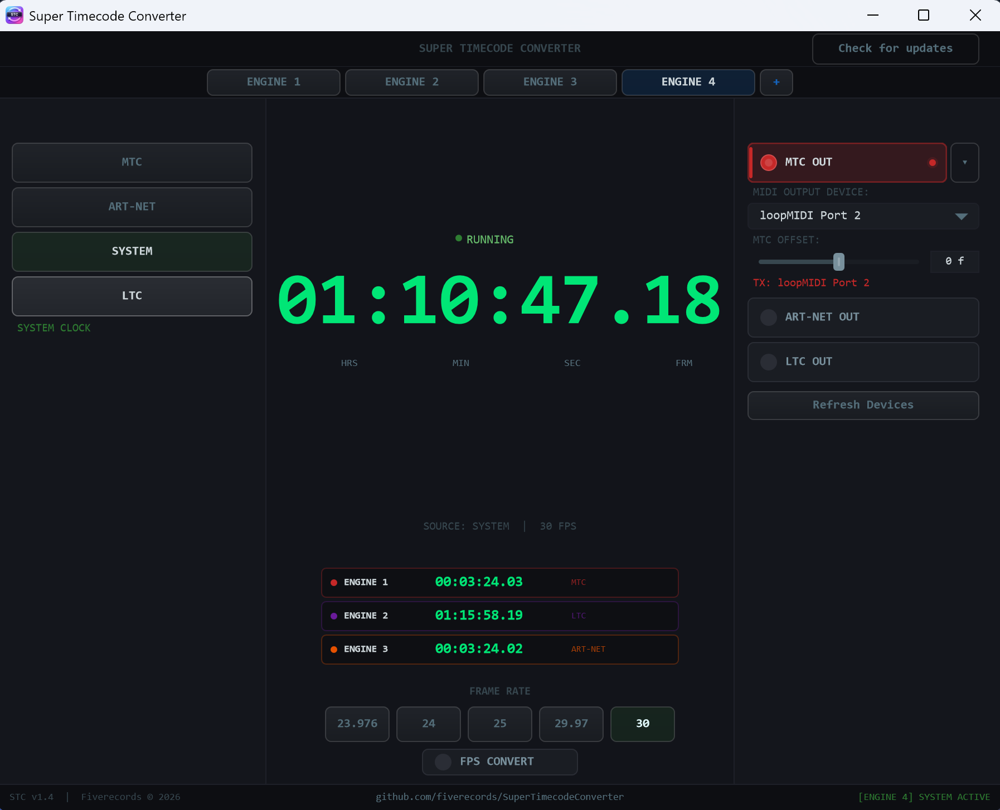

# Super Timecode Converter

A professional timecode routing and conversion tool built with C++ and [JUCE](https://juce.com/). Run up to **8 independent timecode engines** simultaneously — each with its own input source, output destinations, frame rate, and offset. Connect directly to **Pioneer CDJ and DJM hardware** via native Pro DJ Link integration — no additional software required. Ideal for live events, broadcast, post-production, and AV installations.

[](https://github.com/fiverecords/SuperTimecodeConverter/releases)
[](https://github.com/fiverecords/SuperTimecodeConverter/releases/latest)
[](LICENSE)


---

## Features

### Multi-Engine Routing

Run **up to 8 independent timecode engines** simultaneously. Each engine has its own input source, frame rate, output destinations, and offset settings — all running in parallel.

- Route system clock to MTC on one engine while converting LTC input to Art-Net on another
- Feed the same source to multiple outputs with different frame offsets
- Run independent MTC, Art-Net, and LTC pipelines side by side — each with its own device assignments
- Monitor different CDJ players on separate engines — each generating independent timecode streams

Engines are managed through the tab bar at the top of the window. Click **+** to add a new engine, right-click a tab to rename or remove it. The dashboard in the centre shows all engines at a glance with their current timecodes and status.

Audio passthrough (channel 2 thru) remains tied to the primary engine (Engine 1), since it shares the audio device with LTC input.

### Inputs (select one per engine)

- **Pro DJ Link** — connect directly to Pioneer CDJ/XDJ/DJM hardware on the network (see below)
- **MTC (MIDI Time Code)** — receive timecode from any MIDI device
- **Art-Net** — receive Art-Net timecode over the network (configurable interface/port)
- **LTC (Linear Time Code)** — decode LTC audio signal from any audio input device and channel
- **System Time** — use the system clock as a timecode source

### Outputs (enable any combination per engine)

- **MTC Out** — transmit MIDI Time Code (Quarter Frame + Full Frame messages)
- **Art-Net Out** — broadcast ArtTimeCode packets on any network interface
- **LTC Out** — generate LTC audio signal on any audio output device and channel
- **Audio Thru** — passthrough audio from the LTC input device to a separate output device (Engine 1 only, since it shares the audio device with LTC input)

### Pro DJ Link Integration

STC connects directly to Pioneer CDJ and DJM hardware on the network as a Virtual CDJ, converting the DJ's playhead position into frame-accurate SMPTE timecode in real time.

**Tested hardware:** CDJ-3000, CDJ-3000X, DJM-900NXS2, DJM-V10. Other Pro DJ Link compatible hardware (CDJ-2000NXS2, XDJ series, DJM-A9, etc.) should work but has not been verified yet -- please report any issues on GitHub.

**Player tracking:**
- Automatic player discovery on the Pro DJ Link network
- Absolute position tracking from CDJ-3000 / CDJ-3000X (30Hz, millisecond precision)
- Beat-derived position for NXS2 and older models
- Play state detection: Playing, Paused, Cued, Looping, Seeking, End of Track
- BPM, pitch fader, actual playback speed (including motor ramp)
- On-air status, master player detection, beat position
- Per-player monitoring: any engine can follow any of 6 players independently
- **Crossfader auto-follow (XF-A / XF-B):** instead of monitoring a fixed player, an engine can follow whichever deck is live on crossfader side A or B. When the DJ swaps decks, timecode seamlessly switches to the new player. Ideal for two-engine setups where each engine tracks one side of the crossfader.

**Smooth timecode generation:**
- Direct CDJ playhead display with linear interpolation between packets (60Hz smooth output from 30Hz CDJ data)
- PLL-driven pitch calculation for LTC bit-rate scaling
- Instant resync on seek, hot cue, or track load
- Clean pause/stop handling: outputs decelerate naturally following the CDJ motor ramp

**DJM mixer integration:**
- Real-time mixer data from DJM-900NXS2 and DJM-V10
- **DJM-900NXS2:** per-channel faders, trim, EQ (3-band), color/FX, CUE buttons, crossfader, master fader, booth, headphones, beat FX, color FX, mic EQ (76 parameters)
- **DJM-V10:** all of the above plus compressor, EQ (4-band), send, CUE A/B dual-cue, isolator, booth EQ, headphones A/B, filter, master mix (sends), multi I/O (123 parameters). Auto-detected from DJM model name.
- VU meters: per-channel peak metering + Master L/R stereo, 15 segments per channel. 4-channel (900NXS2) or 6-channel (V10) layouts.
- Per-channel on-air status

**Track metadata (via dbserver):**
- Artist, title, album, genre, key, BPM, duration
- Album artwork
- Color preview waveform (ThreeBand and ColorNxs2 formats)

### Track Map

Map tracks by **artist + title** to timecode offsets and show control triggers. When a mapped track is loaded on a CDJ, STC automatically applies the timecode offset and fires the configured triggers. Tracks are identified universally regardless of which USB/SD they are loaded from.

- Per-track timecode offset (HH:MM:SS:FF)
- Per-track BPM multiplier (/4, /2, 1x, x2, x4) — applied to MIDI Clock, Ableton Link, and OSC BPM forward
- Learn mode: capture tracks live from any CDJ player
- Auto-fill artist/title from CDJ metadata

**Per-track triggers (any combination, fired simultaneously on track change):**
- MIDI Note On (+ immediate Note Off)
- MIDI CC (controller + value)
- OSC (address + typed arguments with variable expansion)
- Art-Net DMX (channel + value, configurable universe)

### Mixer Map

Configurable mapping from every DJM mixer parameter to show control protocols. Up to 123 parameters (DJM-V10) can be independently routed to any combination of:

- **OSC** -- normalized float 0.0-1.0, configurable address per parameter
- **MIDI CC** -- 0-127, configurable CC number and channel
- **MIDI Note** -- 0-127 velocity (for grandMA2/MA3 executor faders)
- **Art-Net DMX** -- 0-255, configurable DMX channel and universe

Table editor with per-parameter enable/disable, editable addresses and CC/Note/DMX numbers. Values only sent when changed. DJM model toggle (DJM-900NXS2 / DJM-V10) shows or hides V10-specific parameters. Export and import mixer maps as JSON files for backup or sharing between machines.

### PDL View

External window showing the full Pro DJ Link network state at 30Hz:

- 4-deck display: artwork, color waveform with playhead, track info, BPM (with multiplied value when active), play state, engine assignments
- Per-deck BPM multiplier buttons (single click for session override, double click to save to Track Map)
- Mixer strip: channel faders with segmented VU meters, crossfader, master fader with stereo VU
- DJM-V10 enhanced view: compressor, 4-band EQ, send knobs, dual CUE A/B buttons per channel
- On-air, master, and beat indicators per player

### BPM Multiplier

Scale the BPM sent to MIDI Clock, Ableton Link, and OSC before forwarding — useful for half-time, double-time, or genre-specific workflows where the DJ's BPM doesn't match the lighting or video system's expected tempo.

- **5 multiplier values:** /4, /2, 1x (passthrough), x2, x4
- **Single click** — temporary session override (cleared on next track load)
- **Double click** — save to Track Map (automatically applied every time the track is loaded on any engine)
- **Double click on 1x** — clears any saved multiplier from the Track Map
- Available in both the engine panel and PDL View
- Visual feedback: active multiplier highlighted in blue, saved Track Map value always shown in gold text
- Effective (multiplied) BPM displayed next to the original BPM in both views: `128.0 BPM → 256.0 (x2)`

### Ableton Link

BPM from the selected CDJ player is published to an Ableton Link session. Any Link-enabled peer on the LAN (Resolume, Ableton Live, Traktor, etc.) syncs automatically.

### MIDI Clock & OSC BPM Forward

- **MIDI Clock:** 24ppqn clock driven by CDJ BPM
- **OSC BPM:** sends current BPM as float to configurable OSC address (default: Resolume tempo controller)

### Shared MIDI Output

When MTC output and MIDI triggers/clock/mixer forward target the same MIDI port, STC automatically shares the connection. No configuration needed — both features work simultaneously on a single port, even on Windows where MIDI ports allow only one handle at a time.

### Frame Rate Support

- **23.976 fps** (24000/1001) — cinema and digital cinema workflows
- **24 fps** — film
- **25 fps** — PAL / EBU broadcast
- **29.97 fps drop-frame** — NTSC broadcast (SMPTE-compliant DF counting)
- **30 fps** — non-drop NTSC and general use
- **Auto-detection** from incoming MTC, Art-Net, or LTC signals
- **Output frame rate conversion** — independently convert the output rate from the input rate (e.g. receive 25fps LTC, transmit 29.97 MTC)

> **Note on 23.976 and LTC:** The LTC bitstream cannot distinguish 23.976 from 24fps. When receiving LTC at either of these rates, select the correct rate manually — the app will preserve your selection and suppress auto-detection for that ambiguous pair only.

### Audio Monitoring

- **VU Meters** — real-time level metering for all audio paths (LTC input, LTC output, Audio Thru input, Audio Thru output) with colour-coded feedback (green → yellow → red)
- **Per-channel gain control** — independent input/output gain for LTC and Audio Thru paths

### Synchronization

- **Output frame offsets** — independent offset per output (MTC, Art-Net, LTC) from −30 to +30 frames, to compensate for device latency or synchronization differences

### Additional Capabilities

- **Stereo or mono output:** configurable per output (LTC Out and Audio Thru)
- **Driver type filtering:** filter audio devices by driver type (WASAPI, ASIO, DirectSound on Windows; CoreAudio on macOS; ALSA on Linux)
- **Configurable sample rate and buffer size**
- **ASIO support** for low-latency professional audio interfaces (Windows)
- **Cross-engine device conflict detection** — device selectors show which devices are in use by other engines with colour-coded indicators (cyan for current engine, amber for other engines)
- **Check for updates** — manually check for new versions from the title bar, with automatic check on startup
- **Refresh Devices** — scan for newly connected interfaces without losing existing configuration
- **Collapsible UI panels** to reduce clutter and focus on active sections
- **Persistent settings** — all configuration saved automatically per engine and restored on launch
- **Dark theme UI** with a clean, professional look

---

## Screenshot



---

## Getting Started

### Prerequisites

- **JUCE Framework 8.x** — download from [juce.com](https://juce.com/get-juce/) or clone from [GitHub](https://github.com/juce-framework/JUCE)

#### Windows

- Windows 10/11
- Visual Studio 2022 (Community, Professional, or Enterprise)
- ASIO SDK (optional, for ASIO device support) — download from [Steinberg](https://www.steinberg.net/developers/)

#### macOS

- macOS 12 Monterey or later
- Xcode 14+

#### Linux

- Ubuntu 22.04+ / Debian 12+ (or equivalent)
- GCC 11+ or Clang 14+
- Development packages: `libfreetype-dev libx11-dev libxrandr-dev libxinerama-dev libxcursor-dev libxcomposite-dev libfontconfig1-dev libasound2-dev libcurl4-openssl-dev`

### Build Instructions

#### Option A: CMake (all platforms)

1. **Clone the repository:**
   ```bash
   git clone https://github.com/fiverecords/SuperTimecodeConverter.git
   cd SuperTimecodeConverter
   ```

2. **Clone JUCE** (if you don't have it already):
   ```bash
   git clone --depth 1 --branch 8.0.6 https://github.com/juce-framework/JUCE.git ../JUCE
   ```

3. **Create a `CMakeLists.txt`** in the project root:
   ```cmake
   cmake_minimum_required(VERSION 3.22)
   project(SuperTimecodeConverter VERSION 1.5.2)

   set(CMAKE_CXX_STANDARD 17)
   set(CMAKE_CXX_STANDARD_REQUIRED ON)

   add_subdirectory(${CMAKE_CURRENT_SOURCE_DIR}/../JUCE ${CMAKE_BINARY_DIR}/JUCE)

   juce_add_gui_app(SuperTimecodeConverter
       PRODUCT_NAME "Super Timecode Converter"
       COMPANY_NAME "Fiverecords"
       VERSION "1.5.2"
   )

   juce_generate_juce_header(SuperTimecodeConverter)

   target_sources(SuperTimecodeConverter PRIVATE
       Main.cpp
       MainComponent.cpp
   )

   target_compile_definitions(SuperTimecodeConverter PRIVATE
       JUCE_WEB_BROWSER=0
       JUCE_APPLICATION_NAME_STRING="$<TARGET_PROPERTY:SuperTimecodeConverter,JUCE_PRODUCT_NAME>"
       JUCE_APPLICATION_VERSION_STRING="$<TARGET_PROPERTY:SuperTimecodeConverter,JUCE_VERSION>"
   )

   target_link_libraries(SuperTimecodeConverter PRIVATE
       juce::juce_audio_basics
       juce::juce_audio_devices
       juce::juce_audio_formats
       juce::juce_audio_utils
       juce::juce_core
       juce::juce_events
       juce::juce_graphics
       juce::juce_gui_basics
       juce::juce_gui_extra
       juce::juce_recommended_config_flags
   )
   ```

4. **Build:**
   ```bash
   cmake -B build -DCMAKE_BUILD_TYPE=Release
   cmake --build build -j$(nproc)
   ```

5. The binary will be in `build/SuperTimecodeConverter_artefacts/Release/`

#### Option B: Projucer (Windows / macOS)

1. Clone the repository.
2. Open Projucer and create a new GUI Application project pointing to the source files.
3. Set the JUCE modules path to your local JUCE installation. If using ASIO on Windows, set the ASIO SDK path in the exporter settings.
4. Click "Save and Open in IDE" and build in Visual Studio or Xcode.

### ASIO Setup (Windows, Optional)

1. Download the ASIO SDK from Steinberg.
2. Extract it to a known path (e.g. `C:\SDKs\asiosdk_2.3.3_2019-06-14`).
3. Add the ASIO SDK path to your project's header search paths.
4. Enable `JUCE_ASIO=1` in the project preprocessor definitions.

### Ableton Link (Optional)

To enable Ableton Link tempo sync:

1. Clone the Link SDK: `git clone --recurse-submodules https://github.com/Ableton/link.git`
2. Add include paths: `<link_repo>/include` and `<link_repo>/modules/asio-standalone/asio/include`
3. Define `STC_ENABLE_LINK=1` (plus `LINK_PLATFORM_WINDOWS=1`, `_WIN32_WINNT=0x0602`, `NOMINMAX=1` on Windows)
4. Link against `ws2_32`, `iphlpapi`, `winmm` on Windows (no extra libraries on macOS/Linux)

Without these steps, Link is compiled as a no-op stub and the rest of the app works normally.

---

## Usage

### Basic Workflow

1. **Engine 1** is ready by default. Click **+** in the tab bar to add more engines (up to 8).
2. **Select an input source** from the left panel (Pro DJ Link, MTC, Art-Net, System, or LTC).
3. **Enable one or more outputs** from the right panel.
4. **Select the frame rate** or let it auto-detect from the input signal.
5. The timecode display in the centre shows the current time in real-time.
6. Switch between engines via the tab bar. The dashboard shows all engines at a glance.

### Pro DJ Link Workflow

1. Connect your computer to the same network as your CDJ/DJM setup.
2. **macOS only:** make sure the firewall is disabled or STC is in the allowed list (see [Known Issues](#known-issues--platform-notes)).
3. Select **Pro DJ Link** as input source and choose the network interface.
4. STC will discover players automatically. Select which player (1–6) to follow.
5. Timecode is generated from the CDJ playhead position — load a track, press play, and timecode flows.
6. Open **PDL View** for a full network overview with waveforms, artwork, and mixer state.
7. Open **Track Map** to assign timecode offsets and triggers per track.
8. Open **Mixer Map** to route DJM fader data to OSC, MIDI, or DMX.

### Output Frame Rate Conversion

Enable **FPS Convert** to re-stamp outgoing timecode at a different frame rate from the input. For example, receive 25fps LTC and simultaneously transmit 29.97 MTC and 30fps Art-Net. Each output independently applies this conversion before its frame offset.

### Output Frame Offsets

Each output (MTC, Art-Net, LTC) has an independent frame offset control (−30 to +30 frames). Use this to compensate for device latency or to intentionally advance/delay timecode to specific destinations. Double-click the offset slider to reset to zero.

### Audio Thru

Routes audio from a channel on the LTC input device to a separate output device. Useful when LTC and program audio share a physical device — you can decode LTC on one channel and simultaneously pass through the audio on another.

### Refresh Devices

The **Refresh Devices** button scans for newly connected MIDI devices, audio interfaces, and network interfaces without disrupting existing configuration. Already-configured devices remain selected if they are still present.

### Configuration Backup & Restore

The **Backup** and **Restore** buttons in the title bar let you export and import the entire STC configuration as a single JSON file. The backup bundles all engine settings, Track Map entries, and Mixer Map mappings into one portable file (`stc_backup.json`). Useful for migrating to a new machine, keeping a safety copy before a show, or sharing a known-good setup between systems. Restore replaces all config files and prompts for a restart to fully apply changes.

### Settings

All settings are automatically saved per engine to:

- **Windows:** `%APPDATA%\SuperTimecodeConverter\settings.json`
- **macOS:** `~/Library/Application Support/SuperTimecodeConverter/settings.json`
- **Linux:** `~/.local/share/SuperTimecodeConverter/settings.json`

---

## Known Issues & Platform Notes

### macOS: Disable the Firewall for Pro DJ Link

**This is critical for reliable timecode on macOS.** The macOS application firewall inspects every incoming UDP packet before delivering it to the application. STC's Pro DJ Link network thread receives hundreds of packets per second (CDJ status at 30Hz per player, beat data, DJM mixer/VU data). The firewall inspection adds latency to each packet, and under load the firewall thread itself consumes significant CPU -- enough to delay packet delivery to STC and cause timecode fluctuation, missed beats, and sluggish waveform cursor updates.

**Workaround:** Disable the macOS firewall entirely, or add STC to the firewall's allowed applications list:

1. Open **System Settings > Network > Firewall**
2. Either turn the firewall **Off**, or click **Options...** and add Super Timecode Converter to the allowed list

On Windows this is not an issue -- Windows Firewall prompts once on first launch and does not intercept packets after the rule is created.

### macOS: Unsigned Application

STC is open-source software and is not signed with an Apple Developer certificate. On first launch, macOS Gatekeeper will block the application. To open it:

1. Right-click (or Control-click) the application and select **Open**
2. Click **Open** in the confirmation dialog
3. Alternatively: **System Settings > Privacy & Security > Security**, find the blocked app and click **Open Anyway**

This is a one-time step -- macOS remembers the exception after the first launch.

### macOS: DJM Subscribe Race Condition

On macOS, the DJM-900NXS2 / DJM-V10 may occasionally fail to deliver mixer fader data on the first connection after the DJM is powered on. This is a timing issue in the subscribe handshake. Workaround: restart STC or toggle the Pro DJ Link interface off and on. A delayed-subscribe fix is planned for a future release.

---

## Architecture

The application is built around a modular, header-only architecture:

| Component | Description |
|-----------|-------------|
| `TimecodeCore.h` | Core timecode types, frame rate utilities, SMPTE drop-frame logic, atomic pack/unpack helpers |
| `TimecodeEngine.h` | Per-engine state container: input/output routing, PLL, TrackMap/MixerMap forwarding |
| `ProDJLinkInput.h` | Native Pro DJ Link protocol: player discovery, status, absolute position, DJM mixer/VU data |
| `DbServerClient.h` | Background TCP client for CDJ metadata queries (title, artist, artwork, waveform) |
| `MtcInput.h` | MIDI Time Code receiver (Quarter Frame + Full Frame) with interpolation |
| `MtcOutput.h` | MIDI Time Code transmitter (high-resolution timer with fractional accumulator) |
| `ArtnetInput.h` | Art-Net timecode receiver (UDP) with bind fallback |
| `ArtnetOutput.h` | Art-Net timecode and DMX broadcaster (UDP) with drift-free timing |
| `LtcInput.h` | LTC audio decoder with passthrough ring buffer (SPSC) |
| `LtcOutput.h` | LTC audio encoder with auto-increment and biphase parity |
| `AudioThru.h` | Audio passthrough with independent device routing (Engine 1 only) |
| `NetworkUtils.h` | Cross-platform network interface enumeration (Windows / macOS / Linux) |
| `AppSettings.h` | JSON-based persistent settings, TrackMap and TrackMapEntry types |
| `MixerMap.h` | DJM parameter → OSC / MIDI CC / MIDI Note / Art-Net DMX mapping |
| `OscSender.h` | Lightweight OSC 1.0 sender (int32, float32, string arguments) |
| `TriggerOutput.h` | MIDI and OSC dispatch for track change triggers + continuous mixer forwarding |
| `LinkBridge.h` | Ableton Link tempo sync (compile-time optional, no-op stub when disabled) |
| `ProDJLinkView.h` | External window: 4-deck display with waveforms, artwork, mixer strip with VU meters (V10 enhanced) |
| `MediaDisplay.h` | Color waveform renderer (ThreeBand and ColorNxs2 formats) |
| `TrackMapEditor.h` | Table editor for artist+title → timecode offset + trigger mapping |
| `MixerMapEditor.h` | Table editor for DJM parameter → protocol output mapping |
| `TimecodeDisplay.h` | Real-time timecode display widget |
| `LevelMeter.h` | Real-time VU meter component with clipping indicator |
| `CustomLookAndFeel.h` | Dark theme UI styling, device conflict markers, and cross-platform font selection |
| `UpdateChecker.h` | GitHub release version checker (automatic on startup + manual) |
| `MainComponent.*` | Main UI, engine tab management, routing logic, and device management |

### Key Design Decisions

- **Multi-engine architecture:** each engine encapsulates its own input/output state, enabling up to 8 independent timecode pipelines
- **Lock-free audio:** LTC decode and audio passthrough use lock-free ring buffers (SPSC) for real-time safety
- **Thread safety:** atomics with explicit memory ordering for cross-thread data, SpinLocks for composite structures, SPSC queues for producer-consumer patterns
- **Independent audio devices:** LTC Input, LTC Output, and Audio Thru each manage their own `AudioDeviceManager`, allowing independent device selection
- **Fractional accumulators:** MTC and Art-Net outputs use fractional timing accumulators to eliminate drift from integer-ms timer resolution
- **GPU-accelerated rendering (Windows):** OpenGL context offloads image compositing to GPU, reducing message-thread load. Disabled on macOS where JUCE's OpenGL adds texture-upload overhead through Apple's deprecated OpenGL-to-Metal layer -- CoreGraphics with native Metal compositing is faster
- **PLL-based timecode:** Pro DJ Link input uses a phase-locked loop driven by CDJ actual motor speed for jitter-free LTC bit-rate scaling
- **Interface-bound sockets:** Pro DJ Link UDP sockets are bound to the specific network interface IP, not INADDR_ANY, preventing duplicate packet delivery on multi-interface systems. Beat and status sockets avoid SO_REUSEPORT to prevent kernel packet distribution across stale/duplicate sockets on macOS
- **Background device scanning:** audio devices are scanned on a background thread to avoid blocking the UI on startup
- **Two-phase initialization:** non-audio settings are applied immediately; audio device settings are applied after the background scan completes
- **Cross-engine device conflict detection:** custom popup menu rendering highlights devices in use with colour-coded markers (cyan for current engine, amber with engine name for others)
- **Cross-platform:** built with JUCE for native performance on Windows, macOS, and Linux

---

## Contributing

Contributions are welcome! Please see [CONTRIBUTING.md](CONTRIBUTING.md) for guidelines.

---

## License

This project is licensed under the MIT License — see the [LICENSE](LICENSE) file for details.

---

## Disclaimer

This project is **not affiliated with, endorsed by, or associated with AlphaTheta Corporation or Pioneer DJ** in any way. PRO DJ LINK™ is a trademark of AlphaTheta Corporation. Pioneer DJ is a trademark of Pioneer Corporation, used under license by AlphaTheta Corporation. All other product names, trademarks, and registered trademarks mentioned in this project are the property of their respective owners.

The Pro DJ Link protocol implementation in this project is based on independent community research and documentation, particularly the [DJ Link Ecosystem Analysis](https://djl-analysis.deepsymmetry.org/djl-analysis/) published by Deep Symmetry. This project has not been developed using any proprietary documentation, SDK, or confidential information from AlphaTheta Corporation.

**Use at your own risk.** This software communicates with DJ hardware using an undocumented protocol. While it has been tested with the hardware listed above, behaviour may change with future firmware updates or on untested hardware. The authors accept no responsibility for any issues arising from the use of this software.

Ableton Link™ is a trademark of Ableton AG. This project is not affiliated with, endorsed by, or associated with Ableton AG. The Link SDK is used under the terms of the Ableton Link License.

---

## Credits

Developed by **Joaquin Villodre** — [github.com/fiverecords](https://github.com/fiverecords)

Built with [JUCE](https://juce.com/) — the cross-platform C++ framework for audio applications.

The Pro DJ Link implementation would not have been possible without the incredible protocol documentation by **Deep Symmetry** — their [DJ Link Ecosystem Analysis](https://djl-analysis.deepsymmetry.org/djl-analysis/) provided the foundation for understanding the Pioneer protocol and paved the way for this integration.

---

## Links

- [GitHub Repository](https://github.com/fiverecords/SuperTimecodeConverter)
- [Deep Symmetry — DJ Link Ecosystem Analysis](https://djl-analysis.deepsymmetry.org/djl-analysis/)
- [JUCE Framework](https://juce.com/)
- [Art-Net Protocol](https://art-net.org.uk/)
- [MIDI Time Code Specification](https://en.wikipedia.org/wiki/MIDI_timecode)
