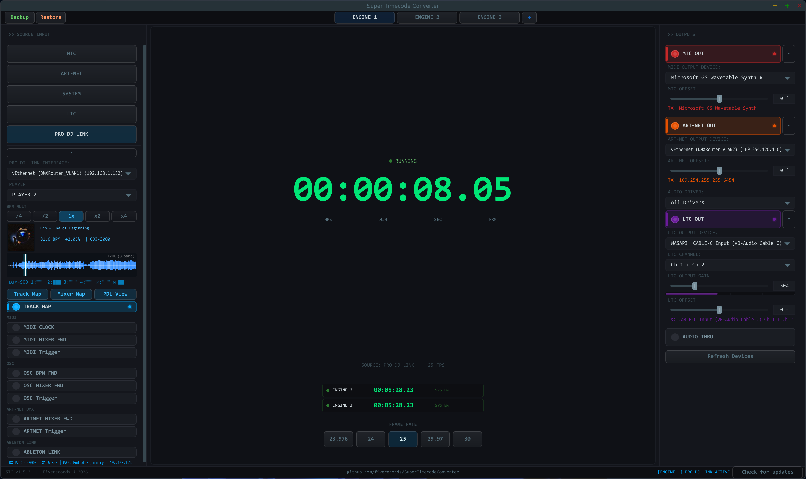

# Super Timecode Converter

A professional timecode routing and conversion tool built with C++ and [JUCE](https://juce.com/). Run up to **8 independent timecode engines** simultaneously — each with its own input source, output destinations, frame rate, and offset. Connect directly to **Pioneer CDJ/DJM hardware** via native Pro DJ Link integration and to **Denon Engine OS hardware** via StageLinQ — no additional software required. **Green Hippo Hippotizer** support via HippoNet is in development. Ideal for live events, broadcast, post-production, and AV installations.

[](https://github.com/fiverecords/SuperTimecodeConverter/releases)
[](https://github.com/fiverecords/SuperTimecodeConverter/releases/latest)
[](LICENSE)




---

## Features

### Multi-Engine Routing

Run **up to 8 independent timecode engines** simultaneously. Each engine has its own input source, frame rate, output destinations, and offset settings — all running in parallel.

- Route internal generator to MTC on one engine while converting LTC input to Art-Net on another
- Feed the same source to multiple outputs with different frame offsets
- Run independent MTC, Art-Net, and LTC pipelines side by side — each with its own device assignments
- Monitor different CDJ or Denon players on separate engines — each generating independent timecode streams

Engines are managed through the tab bar at the top of the window. Click **+** to add a new engine, right-click a tab to rename or remove it. The dashboard in the centre shows all engines at a glance with their current timecodes and status.

Audio passthrough (channel 2 thru) remains tied to the primary engine (Engine 1), since it shares the audio device with LTC input.

### Inputs (select one per engine)

- **Pro DJ Link** — connect directly to Pioneer CDJ/XDJ/DJM hardware on the network (see below)
- **StageLinQ** — connect directly to Denon Engine OS hardware on the network (see below)
- **MTC (MIDI Time Code)** — receive timecode from any MIDI device
- **Art-Net** — receive Art-Net timecode over the network (configurable interface/port)
- **LTC (Linear Time Code)** — decode LTC audio signal from any audio input device and channel
- **Generator** — internal timecode generator with two modes: **Clock** (reads system wall clock for scheduled programming) or **Transport** (play/pause/stop with configurable start/stop timecodes). Includes a **preset system** with named timecode ranges (stored in `generator_presets.json`) — select a preset and press GO to instantly load start/stop timecodes and begin playback. Presets can be imported/exported as JSON files. Supports **OSC remote control** on a configurable UDP port (default 9800) for integration with show controllers, QLab, Companion, and other OSC-capable software.
- **HippoNet** *(coming soon)* — receive timecode from Green Hippo Hippotizer media servers via HippoNet UDP protocol. Supports **multi-layer** packets (TC 1 / TC 2 selectable). Auto-discovery on port 9009. *Currently disabled pending hardware validation.*

### Outputs (enable any combination per engine)

- **MTC Out** — transmit MIDI Time Code (Quarter Frame + Full Frame messages)
- **Art-Net Out** — broadcast ArtTimeCode packets on any network interface
- **LTC Out** — generate LTC audio signal on any audio output device and channel
- **TCNet Out** — broadcast TCNet timecode, playhead, BPM, and beat data (see below)
- **Audio Thru** — passthrough audio from the LTC input device to a separate output device (Engine 1 only, since it shares the audio device with LTC input)

### Pro DJ Link Integration

STC connects directly to Pioneer CDJ and DJM hardware on the network as a Virtual CDJ, converting the DJ's playhead position into frame-accurate SMPTE timecode in real time.

**Tested hardware:** CDJ-3000, CDJ-3000X, CDJ-2000NXS2, DJM-900NXS2, DJM-V10, DJM-A9. Other Pro DJ Link compatible hardware (XDJ series, older CDJ models) should work but has not been verified yet -- please report any issues on GitHub.

**Player tracking:**
- Automatic player discovery on the Pro DJ Link network
- Absolute position tracking from CDJ-3000 / CDJ-3000X (30Hz, millisecond precision)
- Beat-derived position for NXS2 and older models
- Play state detection: Playing, Paused, Cued, Looping, Seeking, End of Track
- BPM, pitch fader, actual playback speed (including motor ramp)
- On-air status, master player detection, beat position
- Per-player monitoring: any engine can follow any of 6 players independently
- **Crossfader auto-follow (XF-A / XF-B):** instead of monitoring a fixed player, an engine can follow whichever deck is live on crossfader side A or B. When the DJ swaps decks, timecode seamlessly switches to the new player. Ideal for two-engine setups where each engine tracks one side of the crossfader.

**Smooth timecode generation:**
- Direct CDJ playhead display with linear interpolation between packets (60Hz smooth output from 30Hz CDJ data)
- PLL-driven pitch calculation for LTC bit-rate scaling
- Beat grid micro-correction: when a rekordbox beat grid is available, the PLL gently nudges toward the nearest beat position between CDJ packets, reducing interpolation drift
- Instant resync on seek, hot cue, or track load
- Clean pause/stop handling: outputs decelerate naturally following the CDJ motor ramp

**DJM mixer integration:**
- Real-time mixer data from DJM-900NXS2, DJM-A9, and DJM-V10
- **DJM-900NXS2:** per-channel faders, trim, EQ (3-band), color/FX, CUE buttons, crossfader, master fader, booth, headphones, beat FX, color FX, mic EQ (58 parameters)
- **DJM-A9:** all of the above plus CUE A/B dual-cue, master CUE B, headphone B, booth EQ, multi I/O, Bluetooth and USB input sources. Beat FX names match the A9 panel (including Triplet Filter, Triplet Roll, Mobius). Mic FX section is internal to the mixer and not available via protocol (71 parameters).
- **DJM-V10:** all of the above plus compressor, EQ (4-band), send, isolator, filter, master mix (sends), channels 5-6 (123 parameters). Auto-detected from DJM model name.
- VU meters: per-channel peak metering + Master L/R stereo, 15 segments per channel. 4-channel (900NXS2, A9) or 6-channel (V10) layouts.
- Per-channel on-air status

**Track metadata (via dbserver):**
- Artist, title, album, genre, key, BPM, duration
- Album artwork
- Color preview waveform (ThreeBand and ColorNxs2 formats)
- High-resolution detail waveform (PWV7 3-band for CDJ-3000, PWV5 color for NXS2)
- Beat grid (PQTZ) -- every beat's position and tempo
- Song structure / phrase analysis (PSSI) -- Intro, Verse, Chorus, Bridge, Outro with mood classification (rekordbox 6+)
- Rekordbox cue list (PCO2/PCOB) -- hot cues with DJ-assigned colors and comments, memory points, stored loops
- CDJ-3000 dynamic loops (start/end from status packets)
- Reverse play detection (from absolute position direction)

### StageLinQ Integration (Denon) -- Preliminary

STC connects to Denon Engine OS hardware via the StageLinQ protocol, receiving deck state, track metadata, mixer fader positions, and beat information in real time.

**Note:** This implementation is based entirely on open-source protocol references and has not yet been tested with real Denon hardware. If you have access to Denon Prime equipment, please try it and report results on [GitHub](https://github.com/fiverecords/SuperTimecodeConverter/issues).

**Supported hardware:** SC5000, SC6000, SC6000M, LC6000, Prime 4, Prime 2, Prime Go, X1800, X1850. Other StageLinQ-compatible hardware should work but has not been verified yet -- please report any issues on GitHub.

**Deck state (via StateMap service):**
- Play/pause/cue state per deck (up to 4 decks per device)
- Current BPM, pitch/speed, speed state
- Track metadata: artist, title, duration, loaded state
- Channel fader positions and crossfader position

**Beat information (via BeatInfo service):**
- Real-time beat position, total beats, and BPM per deck
- Timeline position for playhead tracking
- Beat-in-bar derived from beat position

**Protocol notes:**
- Discovery via UDP broadcast on port 51337
- StateMap and BeatInfo data received over persistent TCP connections
- All strings encoded as UTF-16BE with JSON values
- No additional software or hardware bridge required
- StageLinQ implementation based on open-source reverse-engineering work by chrisle/StageLinq, icedream/go-stagelinq, and Jaxc/PyStageLinQ (all MIT licensed)

**Track metadata (via FileTransfer + Engine Library database):**
- Album artwork
- Overview waveform preview (3-band frequency display) with cue markers (colored by DJ assignment) and minute markers
- Quick cue positions displayed on waveform (up to 8 hot cues with colors and labels from Engine DJ)
- Extended metadata: album, genre, key, BPM, rating

**Known limitations:**
- No DJM-style mixer parameter mapping (Denon mixers expose basic fader data only via StateMap)
- XF-A/XF-B crossfader auto-follow is preliminary -- channel assignment values (0=THRU, 1=A, 2=B) assumed from Pioneer convention, awaiting confirmation with real Denon hardware

### Track Map

Map tracks by **title** (and optionally artist and duration) to timecode offsets and show control triggers. When a mapped track is loaded on a CDJ or Denon deck, STC automatically applies the timecode offset and fires the configured triggers. Tracks are identified universally regardless of which USB/SD they are loaded from. Artist is optional -- tracks without artist metadata (sound effects, jingles, DJ tools) work fully with TrackMap. The duration acts as a fingerprint to distinguish different versions of the same track (e.g. radio edit vs extended mix).

- Per-track timecode offset (HH:MM:SS:FF)
- Per-track BPM multiplier (/4, /2, 1x, x2, x4) -- applied to MIDI Clock, Ableton Link, and OSC BPM forward
- Duration-based track identification -- same artist+title with different lengths are treated as separate tracks
- Learn mode: capture tracks live from any CDJ or Denon deck (auto-captures duration)
- Auto-fill artist/title from CDJ metadata
- **Import from rekordbox XML:** import your entire rekordbox collection into the Track Map from an XML export (File → Export Collection in xml format). Artist, title and duration are imported for each track. Artwork, waveform and cue points populate automatically the first time each track plays on a CDJ.
- **Clear All:** remove all entries from the Track Map with a single click (with confirmation dialog)
- **Enter/Return to save:** press Enter in any form field to save the entry directly, without clicking the Save button

**Per-track triggers (any combination, fired simultaneously on track change):**
- MIDI Note On (+ immediate Note Off)
- MIDI CC (controller + value)
- OSC (address + typed arguments with variable expansion)
- Art-Net DMX (channel + value, configurable universe)

### Cue Points

Per-track timed triggers that fire at specific playhead positions during playback. While track-change triggers fire once when a track is loaded, cue points fire at precise moments within the track -- ideal for lighting cues, pyro triggers, video transitions, and show automation.

- **Capture from playhead:** play the track on a CDJ or Denon deck, press Capture at each key moment. STC reads the current playhead position and creates a cue point there.
- **Visual cue placement:** click or drag anywhere on the waveform strip to place an edit cursor, then Capture to create a cue at that exact position. The edit cursor clears automatically when the playhead moves (jog, scrub, play) or on click outside the waveform.
- **Waveform strip** with four cursor layers: playback position (red, real-time), edit cursor (cyan, click-to-place), cue markers (yellow), selected cue (white, highlighted for identification).
- **Album artwork** displayed in the editor header from live CDJ/Denon or from cached PNG when offline.
- **Multi-selection:** Ctrl+click and Shift+click to select multiple cues. Delete button removes all selected cues at once.
- **Manual entry:** add cue points by typing the position (MM:SS.mmm) directly.
- **Same trigger types as track change:** MIDI Note, MIDI CC, OSC, Art-Net DMX -- any combination per cue point.
- **Seek-aware:** seeking backward resets cues so they fire again. Seeking forward skips already-passed cues.
- **Playback-only firing:** cue points only fire during actual playback. Scrub, jog, and cue preview do not trigger cues -- DJs can preview tracks freely without causing spurious output.
- **Live editing:** cue points added or modified while a track is playing take effect immediately without reloading the track.
- **Waveform and artwork cache:** waveform preview data and album artwork are saved to disk the first time a track is seen. The cue editor shows both even when the CDJ is not connected, enabling offline cue programming.
- **Works with both Pioneer and Denon** hardware via Pro DJ Link and StageLinQ.
- **Auto-populate from rekordbox:** when a track with a TrackMap entry loads on a CDJ, STC automatically imports the DJ's rekordbox hot cues, memory points, and loops as cue points -- with their letters and comments as labels. Also applies when creating a new entry via BPM multiplier double-click. Only applies if the entry has no manually-configured cue points. Blocked during Show Lock.
- **Auto-populate from Denon Engine:** same behavior for StageLinQ -- quick cues (up to 8) from the Engine Library database are imported automatically with their labels and colors. Cue names use hot cue letters (A-H) with Engine DJ labels.
- **Next Cue Countdown:** a live countdown to the next upcoming cue point is displayed below the waveform (format: `▶ NEXT: DROP in 1:05`). Color changes from amber (> 10s) to orange (< 10s) to red (< 3s). Works with both ProDJLink and StageLinQ sources.
- Cue points are stored in the Track Map (trackmap.json) alongside the track's offset and track-change triggers.
- Maximizable window with persisted position across sessions.
- Blocked during Show Lock to prevent accidental changes during a live show.

### Mixer Map

Configurable mapping from every DJM mixer parameter to show control protocols. From 58 parameters (DJM-900NXS2) to 123 (DJM-V10), each independently routed to any combination of:

- **OSC** -- configurable address per parameter
- **MIDI CC** -- configurable CC number and channel
- **MIDI Note** -- velocity-based (for grandMA2/MA3 executor faders)
- **Art-Net DMX** -- configurable DMX channel and universe

Value mapping is automatic based on parameter type:

| Type | Examples | OSC | MIDI CC | DMX |
|------|----------|-----|---------|-----|
| Continuous | faders, EQ, knobs, levels | 0.0-1.0 | 0-127 | 0-255 |
| Toggle | CUE buttons, Beat FX On, Isolator On, Filter LPF/HPF | 0.0 / 1.0 | 0 / 127 | 0 / 255 |
| Discrete | Beat FX Select, XF Assign, Color FX Select, Fader Curve | integer | 0-127 clamped | raw value |

Table editor with per-parameter enable/disable, editable addresses and CC/Note/DMX numbers. Values only sent when changed. Three-way DJM model toggle (DJM-900NXS2 / DJM-A9 / DJM-V10) shows or hides model-specific parameters. Export and import mixer maps as JSON files for backup or sharing between machines.

### PDL View

External window showing the full Pro DJ Link network state at 60Hz. The layout uses priority-based sizing: info text stays readable at any window size, bottom chrome (map/engine/BPM mult rows) hides progressively on small decks, and the detail waveform collapses first when space is tight.

- 4-deck display (2x2 grid or 4x1 horizontal): artwork, track info, BPM (with multiplied value when active), key, cue count, play state, pitch, engine assignments
- **Preview waveform** with playhead cursor, rekordbox cue markers (colored by DJ assignment), minute markers, beat grid (downbeat lines), and stored loop overlays
- **Detail waveform** (scrolling CDJ-style view) centered on playhead with:
  - Beat grid: full-height lines (downbeats brighter, beats subtle)
  - Song structure phrase bar (colored by section: Intro, Verse, Chorus, Bridge, Outro)
  - Rekordbox cue markers: hot cues (colored triangles with letter + comment), memory points (red diamonds), loops (orange with body overlay)
  - Active loop overlay (CDJ-3000 dynamic and stored loops)
  - Zoom control: +/- buttons and scroll wheel (1-32x, per-deck)
  - Fallback to TrackMap cue points when rekordbox data is unavailable
- Per-deck track time: elapsed or remaining (MM:SS / MM:SS), click to toggle per deck
- Status badges: MST (master), AIR (on-air), REV (reverse play)
- Per-deck BPM multiplier buttons (single click for session override, double click to save to Track Map)
- TrackMap offset row: shows mapped offset timecode or "NO MAP"
- Engine assignment row: shows which engines monitor each player
- Mixer strip: channel faders with segmented VU meters, crossfader, master fader with stereo VU
- DJM-V10 enhanced view: compressor, 4-band EQ, send knobs, dual CUE A/B buttons per channel
- DJM-A9 / DJM-V10: dual CUE A/B buttons rendered automatically when detected
- Beat-in-bar indicator per player

### BPM Multiplier

Scale the BPM sent to MIDI Clock, Ableton Link, and OSC before forwarding — useful for half-time, double-time, or genre-specific workflows where the DJ's BPM doesn't match the lighting or video system's expected tempo.

- **5 multiplier values:** /4, /2, 1x (passthrough), x2, x4
- **Single click** — temporary session override (cleared on next track load)
- **Double click** — save to Track Map (automatically applied every time the track is loaded on any engine)
- **Double click on 1x** — clears any saved multiplier from the Track Map
- Available in both the engine panel and PDL View
- Visual feedback: active multiplier highlighted in blue, saved Track Map value always shown in gold text
- Effective (multiplied) BPM displayed next to the original BPM in both views: `128.0 BPM → 256.0 (x2)`

### Ableton Link

BPM from the selected CDJ player or Denon deck is published to an Ableton Link session. Any Link-enabled peer on the LAN (Resolume, Ableton Live, Traktor, etc.) syncs automatically. When using non-DJ sources (MTC, LTC, Art-Net, Generator), BPM can be detected from a live audio input instead.

Link is **exclusive per engine** — only one engine can have Link active at a time. If another engine already owns the Link session, the toggle shows which engine has it. This prevents multiple engines from competing to set the session tempo.

### MIDI Clock & OSC BPM Forward

- **MIDI Clock:** 24ppqn clock driven by CDJ/Denon BPM or audio BPM detection
- **OSC BPM:** sends current BPM to a configurable OSC address. Two modes:
  - **Float mode** (default): sends BPM as an OSC float argument — compatible with Resolume, TouchDesigner, and most OSC receivers. Default address: `/composition/tempocontroller/tempo`
  - **Command template mode**: sends BPM as an OSC string argument with `%BPM%` replaced by the value — for consoles like GrandMA3 that expect string commands. Example: address `/gma3/cmd`, command `Master 3.x at %BPM%` sends `"Master 3.x at 128.5"`

### Audio BPM Detection

Real-time beat tracking from a live audio input, enabling BPM output for non-DJ input sources. When the engine input is MTC, LTC, Art-Net, or Generator, an independent audio device can be configured for BPM analysis. The detected tempo feeds MIDI Clock, OSC BPM forward, and Ableton Link -- the same outputs that Pro DJ Link and StageLinQ use.

- **BPM display** with colour-coded confidence: green (locked), orange (tracking), dim orange (uncertain), grey (no signal)
- **Beat LED** flashes at the detected BPM rate
- **Smoothing slider** (0-100%) controls stability vs responsiveness — combines EMA output smoothing with BTT internal histogram tuning
- **Gain control** for the audio input level
- **Smart UI**: when LTC is the active source, Audio BPM shows its own separate device/channel/gain controls. For other sources, it shares the standard audio settings section.
- **Device markers** show which engines are using which audio devices for BPM detection (same pattern as LTC markers)

Useful for vinyl DJs, MIDI controller DJs, live bands, or any scenario where audio is available but no DJ protocol is present.

### TCNet Output

Full TCNet server for direct integration with Resolume Arena, ChamSys, Avolites, madMapper, and other TCNet-compatible lighting and video systems. No intermediate hardware or bridge software required -- STC replaces the PRO DJ LINK Bridge entirely.

**Why TCNet instead of LTC/MTC for video?**
- **60Hz position updates** vs 24-30Hz with LTC/MTC -- Resolume interpolates between samples, enabling smooth 60fps video playback even from a 24fps timecode source. This breaks the traditional 30fps ceiling that LTC imposed on Resolume clips.
- **Automatic clip triggering** -- Resolume assigns clips by track name. When a CDJ loads a track, Resolume can automatically trigger the matching clip. For non-DJ sources, the engine name becomes the track title, allowing pre-mapped clip assignments per engine.
- **Track metadata** -- artist, title, and album artwork appear in Resolume's deck display. CDJ/Denon tracks show real metadata; non-DJ sources show the input type and engine name.
- **Play/pause sync** -- Resolume follows the CDJ's transport state in real time. Pause on the CDJ pauses the clip in Resolume.
- **Millisecond position** -- TCNet carries playhead position in milliseconds, not frame-quantized SMPTE. Resolume receives sub-frame precision for smoother scrubbing and seeking.
- **Fader-controlled opacity** -- when a DJM or Denon mixer is connected, the channel fader position drives clip opacity in Resolume. Pull down the fader, the video fades out. No mixer = always fully visible.

**Architecture:**
- Broadcast: OptIn + Status on port 60000 (1Hz), Time on port 60001 (60Hz)
- Unicast: automatic slave discovery, Request/Response negotiation, Metrics streaming at 30Hz, Metadata + Artwork on track change
- Per-engine toggle "TCNET OUT" in the outputs panel with layer selector (1-4) and network interface selector
- Works with all input sources: Pro DJ Link, StageLinQ, MTC, Art-Net, LTC, Generator

Protocol reference: https://www.tc-supply.com/tcnet

### Shared MIDI Output

When MTC output and MIDI triggers/clock/mixer forward target the same MIDI port, STC automatically shares the connection. No configuration needed — both features work simultaneously on a single port, even on Windows where MIDI ports allow only one handle at a time.

### Frame Rate Support

- **23.976 fps** (24000/1001) — cinema and digital cinema workflows
- **24 fps** — film
- **25 fps** — PAL / EBU broadcast
- **29.97 fps drop-frame** — NTSC broadcast (SMPTE-compliant DF counting)
- **30 fps** — non-drop NTSC and general use
- **Auto-detection** from incoming MTC, Art-Net, or LTC signals
- **Output frame rate conversion** — independently convert the output rate from the input rate (e.g. receive 25fps LTC, transmit 29.97 MTC)

> **Note on 23.976 and LTC:** The LTC bitstream cannot distinguish 23.976 from 24fps. When receiving LTC at either of these rates, select the correct rate manually — the app will preserve your selection and suppress auto-detection for that ambiguous pair only.

### Audio Monitoring

- **VU Meters** — real-time level metering for all audio paths (LTC input, LTC output, Audio Thru input, Audio Thru output) with colour-coded feedback (green → yellow → red)
- **Per-channel gain control** — independent input/output gain for LTC and Audio Thru paths

### Synchronization

- **Output frame offsets** — independent offset per output (MTC, Art-Net, LTC) from -30 to +30 frames, to compensate for device latency or synchronization differences
- **TCNet output offset** — independent offset in milliseconds (-1000 to +1000 ms) for the TCNet output, separate from the frame-based offsets used by MTC/Art-Net/LTC

### Show Lock

Prevents accidental changes during live shows. A single click on the **SHOW LOCK** button in the tab bar locks all configuration: input sources, frame rates, device assignments, engine add/remove, TrackMap editor, output frame offsets, integration toggles (OSC, MIDI clock, MIDI/ArtNet mixer forward, Ableton Link, triggers), and backup/restore. Attempting a blocked action flashes the lock button as visual feedback; ComboBox and slider selections revert automatically.

Operational controls remain active while locked: output enable/disable (for emergency silencing), gain sliders, BPM multiplier, freewheel controls, and view windows. Unlock requires a confirmation dialog to prevent accidental unlock. Lock state persists across restarts.

### Additional Capabilities

- **Stereo or mono output:** configurable per output (LTC Out and Audio Thru)
- **Driver type filtering:** filter audio devices by driver type (WASAPI, ASIO, DirectSound on Windows; CoreAudio on macOS; ALSA on Linux)
- **Configurable sample rate and buffer size**
- **ASIO support** for low-latency professional audio interfaces (Windows)
- **Cross-engine device conflict detection** — device selectors show which devices are in use by other engines with colour-coded indicators (cyan for current engine, amber for other engines)
- **Check for updates** — manually check for new versions from the title bar, with automatic check on startup
- **Refresh Devices** — scan for newly connected interfaces without losing existing configuration
- **Collapsible UI panels** to reduce clutter and focus on active sections
- **Persistent settings** — all configuration saved automatically per engine and restored on launch
- **Dark theme UI** with a clean, professional look

---

## Getting Started

### Download Precompiled Binaries

Ready-to-use installers and app bundles are available in the [GitHub Releases](https://github.com/fiverecords/SuperTimecodeConverter/releases) page. Each release includes precompiled binaries for Windows (.exe installer) and macOS (.dmg). No build tools or dependencies required -- just download, install, and run.

The sections below are for developers who want to build STC from source.

---

### Prerequisites

- **JUCE Framework 8.x** — download from [juce.com](https://juce.com/get-juce/) or clone from [GitHub](https://github.com/juce-framework/JUCE)

#### Windows

- Windows 10/11
- Visual Studio 2022 (Community, Professional, or Enterprise)
- ASIO SDK (optional, for ASIO device support) — download from [Steinberg](https://www.steinberg.net/developers/)

#### macOS

- macOS 12 Monterey or later
- Xcode 14+

#### Linux

- Ubuntu 22.04+ / Debian 12+ (or equivalent)
- GCC 11+ or Clang 14+
- Development packages: `libfreetype-dev libx11-dev libxrandr-dev libxinerama-dev libxcursor-dev libxcomposite-dev libfontconfig1-dev libasound2-dev libcurl4-openssl-dev`

### Build Instructions

#### Option A: CMake (all platforms)

1. **Clone the repository:**
   ```bash
   git clone https://github.com/fiverecords/SuperTimecodeConverter.git
   cd SuperTimecodeConverter
   ```

2. **Clone JUCE** (if you don't have it already):
   ```bash
   git clone --depth 1 --branch 8.0.6 https://github.com/juce-framework/JUCE.git ../JUCE
   ```

3. **Create a `CMakeLists.txt`** in the project root:
   ```cmake
   cmake_minimum_required(VERSION 3.22)
   project(SuperTimecodeConverter VERSION 1.9.1)

   set(CMAKE_CXX_STANDARD 17)
   set(CMAKE_CXX_STANDARD_REQUIRED ON)

   add_subdirectory(${CMAKE_CURRENT_SOURCE_DIR}/../JUCE ${CMAKE_BINARY_DIR}/JUCE)

   juce_add_gui_app(SuperTimecodeConverter
       PRODUCT_NAME "Super Timecode Converter"
       COMPANY_NAME "Fiverecords"
       VERSION "1.9.1"
       HARDENED_RUNTIME_ENABLED TRUE
       HARDENED_RUNTIME_OPTIONS com.apple.security.device.audio-input
       MICROPHONE_PERMISSION_ENABLED TRUE
       MICROPHONE_PERMISSION_TEXT "STC needs access to your audio interface for LTC input"
   )

   juce_generate_juce_header(SuperTimecodeConverter)

   target_sources(SuperTimecodeConverter PRIVATE
       Main.cpp
       MainComponent.cpp
       sqlite3.c
   )

   target_compile_definitions(SuperTimecodeConverter PRIVATE
       JUCE_WEB_BROWSER=0
       JUCE_APPLICATION_NAME_STRING="$<TARGET_PROPERTY:SuperTimecodeConverter,JUCE_PRODUCT_NAME>"
       JUCE_APPLICATION_VERSION_STRING="$<TARGET_PROPERTY:SuperTimecodeConverter,JUCE_VERSION>"
       SQLITE_THREADSAFE=1
   )

   target_link_libraries(SuperTimecodeConverter PRIVATE
       juce::juce_audio_basics
       juce::juce_audio_devices
       juce::juce_audio_formats
       juce::juce_audio_utils
       juce::juce_core
       juce::juce_events
       juce::juce_graphics
       juce::juce_gui_basics
       juce::juce_gui_extra
       juce::juce_cryptography
       juce::juce_recommended_config_flags
   )
   ```

4. **Build:**
   ```bash
   cmake -B build -DCMAKE_BUILD_TYPE=Release
   cmake --build build -j$(nproc)
   ```

5. The binary will be in `build/SuperTimecodeConverter_artefacts/Release/`

#### Option B: Projucer (Windows / macOS)

1. Clone the repository.
2. Open Projucer and create a new GUI Application project pointing to the source files.
3. Set the JUCE modules path to your local JUCE installation. If using ASIO on Windows, set the ASIO SDK path in the exporter settings.
4. Click "Save and Open in IDE" and build in Visual Studio or Xcode.

### ASIO Setup (Windows, Optional)

1. Download the ASIO SDK from Steinberg.
2. Extract it to a known path (e.g. `C:\SDKs\asiosdk_2.3.3_2019-06-14`).
3. Add the ASIO SDK path to your project's header search paths.
4. Enable `JUCE_ASIO=1` in the project preprocessor definitions.

### Ableton Link (Optional)

To enable Ableton Link tempo sync:

1. Clone the Link SDK: `git clone --recurse-submodules https://github.com/Ableton/link.git`
2. Add include paths: `<link_repo>/include` and `<link_repo>/modules/asio-standalone/asio/include`
3. Define `STC_ENABLE_LINK=1` (plus `LINK_PLATFORM_WINDOWS=1`, `_WIN32_WINNT=0x0602`, `NOMINMAX=1` on Windows)
4. Link against `ws2_32`, `iphlpapi`, `winmm` on Windows (no extra libraries on macOS/Linux)

Without these steps, Link is compiled as a no-op stub and the rest of the app works normally.

---

## Usage

### Basic Workflow

1. **Engine 1** is ready by default. Click **+** in the tab bar to add more engines (up to 8).
2. **Select an input source** from the left panel (Pro DJ Link, MTC, Art-Net, System, or LTC).
3. **Enable one or more outputs** from the right panel.
4. **Select the frame rate** or let it auto-detect from the input signal.
5. The timecode display in the centre shows the current time in real-time.
6. Switch between engines via the tab bar. The dashboard shows all engines at a glance.

### Pro DJ Link Workflow

1. Connect your computer to the same network as your CDJ/DJM setup.
2. **macOS only:** make sure the firewall is disabled or STC is in the allowed list (see [Known Issues](#known-issues--platform-notes)).
3. Select **Pro DJ Link** as input source and choose the network interface.
4. STC will discover players automatically. Select which player (1–6) to follow.
5. Timecode is generated from the CDJ playhead position — load a track, press play, and timecode flows.
6. Open **PDL View** for a full network overview with waveforms, artwork, and mixer state.
7. Open **Track Map** to assign timecode offsets and triggers per track.
8. Open **Mixer Map** to route DJM fader data to OSC, MIDI, or DMX.

### Output Frame Rate Conversion

Enable **FPS Convert** to re-stamp outgoing timecode at a different frame rate from the input. For example, receive 25fps LTC and simultaneously transmit 29.97 MTC and 30fps Art-Net. Each output independently applies this conversion before its frame offset.

### Output Frame Offsets

Each output (MTC, Art-Net, LTC) has an independent frame offset control (−30 to +30 frames). Use this to compensate for device latency or to intentionally advance/delay timecode to specific destinations. Double-click the offset slider to reset to zero.

### Audio Thru

Routes audio from a channel on the LTC input device to a separate output device. Useful when LTC and program audio share a physical device — you can decode LTC on one channel and simultaneously pass through the audio on another.

### Refresh Devices

The **Refresh Devices** button scans for newly connected MIDI devices, audio interfaces, and network interfaces without disrupting existing configuration. Already-configured devices remain selected if they are still present.

### Configuration Backup & Restore

The **Backup** and **Restore** buttons in the title bar let you export and import the entire STC configuration as a single JSON file. The backup bundles all engine settings, Track Map entries, Mixer Map mappings, and Generator Presets into one portable file (`stc_backup.json`). Useful for migrating to a new machine, keeping a safety copy before a show, or sharing a known-good setup between systems. Restore replaces all config files and prompts for a restart to fully apply changes.

### Settings

All settings are automatically saved per engine to:

- **Windows:** `%APPDATA%\SuperTimecodeConverter\settings.json`
- **macOS:** `~/Library/Application Support/SuperTimecodeConverter/settings.json`
- **Linux:** `~/.local/share/SuperTimecodeConverter/settings.json`

---

## Known Issues & Platform Notes

### macOS: Disable the Firewall for Pro DJ Link

**This is critical for reliable timecode on macOS.** The macOS application firewall inspects every incoming UDP packet before delivering it to the application. STC's Pro DJ Link network thread receives hundreds of packets per second (CDJ status at 30Hz per player, beat data, DJM mixer/VU data). The firewall inspection adds latency to each packet, and under load the firewall thread itself consumes significant CPU -- enough to delay packet delivery to STC and cause timecode fluctuation, missed beats, and sluggish waveform cursor updates.

**Workaround:** Disable the macOS firewall entirely, or add STC to the firewall's allowed applications list:

1. Open **System Settings > Network > Firewall**
2. Either turn the firewall **Off**, or click **Options...** and add Super Timecode Converter to the allowed list

On Windows this is not an issue -- Windows Firewall prompts once on first launch and does not intercept packets after the rule is created.

### macOS: Unsigned Application

STC is open-source software and is not signed with an Apple Developer certificate. On first launch, macOS Gatekeeper will block the application. To open it:

1. Right-click (or Control-click) the application and select **Open**
2. Click **Open** in the confirmation dialog
3. Alternatively: **System Settings > Privacy & Security > Security**, find the blocked app and click **Open Anyway**

This is a one-time step -- macOS remembers the exception after the first launch.

### macOS: Microphone Permission for LTC Input

Since macOS Catalina, all audio input access requires explicit microphone permission -- including virtual audio devices like BlackHole, Loopback, and aggregate devices. Without permission, CoreAudio opens the device successfully but delivers silent buffers. STC will show the device name in the status bar and populate the channel selector, but the input level meter stays flat and no LTC is decoded.

**CMake builds:** The `juce_add_gui_app` block in CMakeLists.txt includes `MICROPHONE_PERMISSION_ENABLED TRUE`, which embeds the `NSMicrophoneUsageDescription` key in the app bundle's Info.plist. macOS will prompt for microphone access on first launch. If STC was built from an older CMakeLists.txt without this key, macOS silently blocks input with no prompt. Rebuild with the current CMakeLists.txt to fix.

**Projucer builds:** Enable "Microphone Permission" in the Projucer exporter settings (enabled by default in the .jucer project).

**If permission was already denied:** Go to **System Settings > Privacy & Security > Microphone** and toggle Super Timecode Converter ON.

### AnyDesk Port Conflict (Pro DJ Link and TCNet)

AnyDesk remote desktop software uses UDP ports in the 50000-60001 range -- overlapping with both **Pro DJ Link** (ports 50000-50002) and **TCNet** (ports 60000-60001). When AnyDesk is installed and its background service is running, it can intercept or block UDP traffic on these ports, causing:

- **Pro DJ Link:** CDJs fail to send absolute position data (abspos packets) to STC. Timecode updates at ~5Hz instead of 67Hz, producing visible stuttering. Keepalive and status packets may still arrive, making the connection appear partially functional.
- **TCNet:** Resolume and other TCNet slaves cannot receive Time packets from STC. The connection fails completely.

This affects any software using these ports, including the official PRO DJ LINK Bridge.

**Workaround:** Uninstall AnyDesk, or stop its background service before using STC. On Windows: open Services (services.msc), find "AnyDesk Service", and set it to Manual or Disabled. On macOS: quit AnyDesk from the menu bar.

### macOS: DJM Subscribe Race Condition

On macOS, the DJM-900NXS2 / DJM-A9 / DJM-V10 may occasionally fail to deliver mixer fader data on the first connection after the DJM is powered on. This is a timing issue in the subscribe handshake. Workaround: restart STC or toggle the Pro DJ Link interface off and on. A delayed-subscribe fix is planned for a future release.

### rekordbox Cannot Run Simultaneously with STC

STC and rekordbox use the same UDP ports for Pro DJ Link communication (50000, 50001, 50002). Running both applications at the same time on the same machine causes port conflicts: CDJ discovery fails, status packets are lost, and neither application works correctly. This is the same limitation that affects the official PRO DJ LINK Bridge.

**Workaround:** Close rekordbox before starting STC, or run them on separate computers on the same network. If rekordbox was running and you switch to STC, you may need to restart STC to re-bind the ports cleanly.

---

## Virtual Routing (Software Loopback)

When STC runs on the same machine as your lighting console, DAW, or VJ software, you need virtual devices to route MTC and LTC between applications. These are free tools that create loopback devices on your system:

### MIDI (for MTC output to lighting/VJ software on the same machine)

| Platform | Tool | Notes |
|----------|------|-------|
| Windows | [loopMIDI](https://www.tobias-erichsen.de/software/loopmidi.html) | Creates virtual MIDI ports. Free, lightweight, runs in system tray. |
| macOS | IAC Driver (built-in) | Open **Audio MIDI Setup** > **MIDI Studio** > double-click **IAC Driver** > enable **Device is online**. No install needed. |
| Linux | `snd-virmidi` kernel module | `sudo modprobe snd-virmidi`. Creates virtual MIDI ports automatically. |

### Audio (for LTC output to other software on the same machine)

| Platform | Tool | Notes |
|----------|------|-------|
| Windows | [VB-CABLE](https://vb-audio.com/Cable/) | Virtual audio cable. Free for one cable, donationware for additional cables. |
| macOS | [BlackHole](https://existential.audio/blackhole/) | Open-source virtual audio driver (2ch or 16ch). Free. |
| Linux | PulseAudio / PipeWire | Built-in loopback modules. `pactl load-module module-loopback` or PipeWire virtual devices. |

STC outputs MTC and LTC on standard system devices. Select the virtual device as STC's output, and the same virtual device as input in your receiving application (e.g. grandMA2/3, Resolume, Reaper, ChamSys).

---

## Architecture

The application is built around a modular, header-only architecture:

| Component | Description |
|-----------|-------------|
| `TimecodeCore.h` | Core timecode types, frame rate utilities, SMPTE drop-frame logic, atomic pack/unpack helpers |
| `TimecodeEngine.h` | Per-engine state container: input/output routing, PLL, TrackMap/MixerMap forwarding |
| `ProDJLinkInput.h` | Native Pro DJ Link protocol: player discovery, status, absolute position, DJM mixer/VU data |
| `DbServerClient.h` | Background TCP client for CDJ metadata queries (title, artist, artwork, waveform, beat grid, cue list, song structure, detail waveform). Two-phase request pipeline with disk cache (ANLZ) |
| `NfsAnlzFetcher.h` | NFS download of rekordbox ANLZ files (.DAT/.EXT) directly from CDJ USB/SD. Fallback when dbserver tag queries fail on CDJ-3000 |
| `MtcInput.h` | MIDI Time Code receiver (Quarter Frame + Full Frame) with interpolation |
| `MtcOutput.h` | MIDI Time Code transmitter (high-resolution timer with fractional accumulator) |
| `ArtnetInput.h` | Art-Net timecode receiver (UDP) with bind fallback |
| `ArtnetOutput.h` | Art-Net timecode and DMX broadcaster (UDP) with drift-free timing |
| `TCNetOutput.h` | Full TCNet server: broadcast + unicast with slave discovery, Metrics streaming, Metadata, Artwork |
| `HippotizerInput.h` | HippoNet timecode receiver: UDP port 6091, multi-layer (TC1/TC2), auto-discovery on port 9009 |
| `StcLogoData.h` | Embedded STC logo JPEG (300x300) for TCNet artwork fallback |
| `LtcInput.h` | LTC audio decoder with passthrough ring buffer (SPSC) |
| `LtcOutput.h` | LTC audio encoder with auto-increment and biphase parity |
| `AudioThru.h` | Audio passthrough with independent device routing (Engine 1 only) |
| `NetworkUtils.h` | Cross-platform network interface enumeration (Windows / macOS / Linux) |
| `AppSettings.h` | JSON-based persistent settings, TrackMap and TrackMapEntry types |
| `MixerMap.h` | DJM parameter mapping with three-tier model support (900NXS2 / A9 / V10) and ParamType-aware value mapping (Continuous / Toggle / Discrete) |
| `OscSender.h` | Lightweight OSC 1.0 sender (int32, float32, string arguments) |
| `OscInputServer.h` | OSC 1.0 UDP listener with message parsing and dispatch for generator remote control |
| `TriggerOutput.h` | MIDI and OSC dispatch for track change triggers + continuous mixer forwarding |
| `LinkBridge.h` | Ableton Link tempo sync (compile-time optional, no-op stub when disabled) |
| `AudioBpmInput.h` | Real-time audio BPM detection: independent AudioDeviceManager, BTT integration, EMA smoothing, atomic BPM/beat/confidence output |
| `BTT.h` | Standalone public API header for the Beat-and-Tempo-Tracking library |
| `btt_build.cpp` | C++ build wrapper for BTT amalgamation (MSVC compatibility, macro isolation) |
| `btt_amalgamation.inc` | Single-file BTT library amalgamation (not added to Projucer, included by btt_build.cpp) |
| `StageLinQInput.h` | Native StageLinQ protocol: device discovery, StateMap, BeatInfo, mixer state |
| `StageLinQDbClient.h` | Engine Library database access via FileTransfer + SQLite for waveform preview and artwork |
| `StageLinQView.h` | External window: Denon deck display with track info, deck state, mixer data |
| `ProDJLinkView.h` | External window: 4-deck display with preview + detail waveforms, rekordbox cue markers, beat grid, song structure phrases, artwork, mixer strip with VU meters |
| `MediaDisplay.h` | Color waveform preview renderer (ThreeBand and ColorNxs2 formats) with beat grid lines, rekordbox cue markers, loop overlays, and minute markers |
| `WaveformDetailDisplay.h` | Scrolling detail waveform (CDJ-style) with beat grid, song structure phrases, cue markers, loop overlays, zoom, and playhead cursor |
| `WaveformCache.h` | Disk cache for waveform preview, album artwork, and ANLZ data (beat grid, cues, phrases, detail waveform) |
| `TrackMapEditor.h` | Table editor for artist+title -> timecode offset + trigger mapping |
| `CuePointEditor.h` | Table editor for per-track cue points with waveform strip, click + drag cursor, Capture from live playhead |
| `GeneratorPresetEditor.h` | Table editor for generator presets (Name, Start TC, Stop TC) |
| `MixerMapEditor.h` | Table editor for DJM parameter -> protocol output mapping |
| `TimecodeDisplay.h` | Real-time timecode display widget |
| `LevelMeter.h` | Real-time VU meter component with clipping indicator |
| `CustomLookAndFeel.h` | Dark theme UI styling, device conflict markers, and cross-platform font selection |
| `UpdateChecker.h` | GitHub release version checker (automatic on startup + manual) |
| `MainComponent.*` | Main UI, engine tab management, routing logic, and device management |

### Key Design Decisions

- **Multi-engine architecture:** each engine encapsulates its own input/output state, enabling up to 8 independent timecode pipelines
- **Lock-free audio:** LTC decode and audio passthrough use lock-free ring buffers (SPSC) for real-time safety
- **Thread safety:** atomics with explicit memory ordering for cross-thread data, SpinLocks for composite structures, SPSC queues for producer-consumer patterns
- **Independent audio devices:** LTC Input, LTC Output, Audio Thru, and Audio BPM each manage their own `AudioDeviceManager`, allowing independent device selection
- **BTT amalgamation:** the Beat-and-Tempo-Tracking library is bundled as a single-file amalgamation (same pattern as sqlite3) with `extern "C"` linkage and MSVC macro isolation (`#undef real/imag` against JUCE PCH contamination)
- **Fractional accumulators:** MTC and Art-Net outputs use fractional timing accumulators to eliminate drift from integer-ms timer resolution
- **Native rendering:** OpenGL context intentionally disabled to prevent GL-thread data races on juce::String refcounts (paint() vs timerCallback()). Windows DWM already hardware-accelerates the native GDI composite path, and the waveform/deck image caches minimize per-frame paint work
- **PLL-based timecode:** Pro DJ Link input uses a phase-locked loop driven by CDJ actual motor speed for jitter-free LTC bit-rate scaling
- **Interface-bound sockets:** Pro DJ Link UDP sockets (beat, status, bridge) are bound to the specific network interface IP, not INADDR_ANY, preventing duplicate packet delivery on multi-interface systems. The keepalive socket binds to the interface IP on Windows (to force the correct outgoing NIC on multi-adapter systems) but to INADDR_ANY on macOS (where broadcast reception requires it). Beat and status sockets avoid SO_REUSEPORT to prevent kernel packet distribution across stale/duplicate sockets on macOS
- **Background device scanning:** audio devices are scanned on a background thread to avoid blocking the UI on startup
- **Two-phase initialization:** non-audio settings are applied immediately; audio device settings are applied after the background scan completes
- **Cross-engine device conflict detection:** custom popup menu rendering highlights devices in use with colour-coded markers (cyan for current engine, amber with engine name for others)
- **Cross-platform:** built with JUCE for native performance on Windows, macOS, and Linux

---

## Contributing

Contributions are welcome! Please see [CONTRIBUTING.md](CONTRIBUTING.md) for guidelines.

---

## License

This project is licensed under the MIT License — see the [LICENSE](LICENSE) file for details.

---

## Disclaimer

This project is **not affiliated with, endorsed by, or associated with AlphaTheta Corporation or Pioneer DJ** in any way. PRO DJ LINK is a trademark of AlphaTheta Corporation. Pioneer DJ is a trademark of Pioneer Corporation, used under license by AlphaTheta Corporation.

This project is **not affiliated with, endorsed by, or associated with inMusic Brands, Inc., Denon DJ, or Engine DJ** in any way. Denon is a trademark of D&M Holdings Inc. Denon DJ and Engine DJ are trademarks of inMusic Brands, Inc. StageLinQ is a protocol developed by inMusic/Denon DJ for their Engine OS hardware.

This project is **not affiliated with, endorsed by, or associated with TC-Supply or Event Imagineering Group** in any way. TCNet is an open protocol created by TC-Supply / Event Imagineering Group.

This project is **not affiliated with, endorsed by, or associated with Resolume B.V.** in any way. Resolume Arena is a trademark of Resolume B.V.

Ableton Link is a trademark of Ableton AG. This project is not affiliated with, endorsed by, or associated with Ableton AG. The Link SDK is used under the terms of the Ableton Link License.

ChamSys, Avolites, madMapper, and all other product names, trademarks, and registered trademarks mentioned in this project are the property of their respective owners.

Hippotizer is a trademark of Green Hippo Ltd (a tvONE brand). This project is not affiliated with, endorsed by, or associated with Green Hippo Ltd or tvONE. The HippoNet protocol implementation is based on independent Wireshark capture analysis.

grandMA3 is a trademark of MA Lighting Technology GmbH. This project is not affiliated with, endorsed by, or associated with MA Lighting Technology GmbH.

This project has not been developed using any proprietary documentation, SDK, or confidential information from any of the above companies. The Pro DJ Link and StageLinQ implementations are based on independent community research. The TCNet implementation is based on the [TCNet Link Specification V3.5.1B](https://www.tc-supply.com/tcnet) (open protocol, free to use).

**Use at your own risk.** This software communicates with DJ hardware and lighting/video systems using a combination of documented open protocols (TCNet) and undocumented protocols (Pro DJ Link, StageLinQ, HippoNet). While it has been tested with the hardware listed above, behaviour may change with future firmware updates or on untested hardware. The authors accept no responsibility for any issues arising from the use of this software.

---

## Credits

Developed by **Joaquin Villodre** -- [github.com/fiverecords](https://github.com/fiverecords)

Built with [JUCE](https://juce.com/) -- the cross-platform C++ framework for audio applications.

The Pro DJ Link implementation would not have been possible without the incredible protocol documentation by **Deep Symmetry** -- their [DJ Link Ecosystem Analysis](https://djl-analysis.deepsymmetry.org/djl-analysis/) provided the foundation for understanding the Pioneer protocol and paved the way for this integration.

The StageLinQ implementation is built on the open-source reverse-engineering work of three projects: **chrisle/StageLinq** by Chris Le and Martijn Reuvers (TypeScript, the most complete implementation including FileTransfer and database access), **icedream/go-stagelinq** by Carl Kittelberger (Go, clean protocol reference and BeatInfo), and **Jaxc/PyStageLinQ** by Jaxc (Python, byte-level protocol documentation and Wireshark dissector). Their collective work made third-party StageLinQ integration possible.

Real-time audio BPM detection is powered by **[Beat-and-Tempo-Tracking (BTT)](https://github.com/michaelkrzyzaniak/Beat-and-Tempo-Tracking)** by Michael Krzyzaniak (MIT license) -- a zero-dependency ANSI C library for causal beat and tempo tracking, originally designed for musical robots at the University of Rochester.

---

## Links

- [GitHub Repository](https://github.com/fiverecords/SuperTimecodeConverter)
- [Deep Symmetry -- DJ Link Ecosystem Analysis](https://djl-analysis.deepsymmetry.org/djl-analysis/)
- [chrisle/StageLinq -- TypeScript StageLinQ library](https://github.com/chrisle/StageLinq)
- [icedream/go-stagelinq -- Go StageLinQ library](https://github.com/icedream/go-stagelinq)
- [Jaxc/PyStageLinQ -- Python StageLinQ library](https://github.com/Jaxc/PyStageLinQ)
- [Beat-and-Tempo-Tracking (BTT) -- Audio BPM detection](https://github.com/michaelkrzyzaniak/Beat-and-Tempo-Tracking)
- [JUCE Framework](https://juce.com/)
- [Art-Net Protocol](https://art-net.org.uk/)
- [TCNet Protocol Specification](https://www.tc-supply.com/tcnet)
- [MIDI Time Code Specification](https://en.wikipedia.org/wiki/MIDI_timecode)
